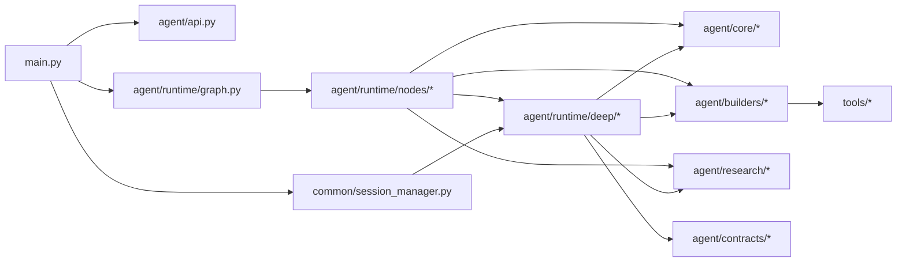
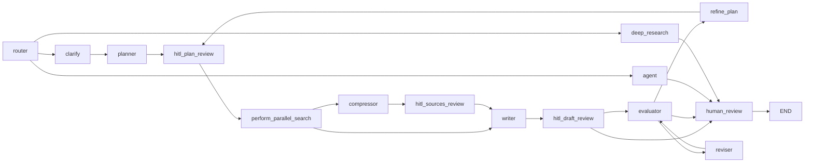

# Agent 模块架构分析

更新日期：2026-04-02

## 1. 分析范围

本文基于当前仓库中的这些实现做静态分析：

- `agent/api.py`
- `agent/runtime/graph.py`
- `agent/runtime/nodes/*`
- `agent/runtime/deep/*`
- `agent/core/*`
- `agent/builders/*`
- `agent/contracts/*`
- `agent/research/*`
- `main.py`
- `common/session_manager.py`

未展开分析的范围：

- `support_agent.py` 及 support graph
- 前端渲染细节
- 第三方工具实现内部细节

## 2. 架构结论

### 显式事实

- `agent` 包已经被整理成“稳定 API 面 + 内部运行时”的结构：对外通过 `agent/api.py` 和 `agent/contracts/*` 暴露稳定入口，对内由 `agent/runtime/*`、`agent/core/*`、`agent/builders/*`、`agent/research/*` 组成执行内核。
- 主执行入口在 `main.py`：启动时通过 `create_research_graph()` 编译 `research_graph`，请求时通过 `research_graph.ainvoke()` 或 `research_graph.astream_events()` 驱动执行。
- 外层 LangGraph 主图现在只承载两条公开模式路径：`agent`、`deep`，以及一条内部 `clarify` 门控路径。`deep` 路径在外层表现为单个 `deep_research` 节点，但节点内部已经委托给 `agent/runtime/deep/orchestration/graph.py` 中的多 agent 子图。
- Deep Research 的公开运行时输入已经收敛到 `multi_agent`，旧的 legacy engine 和 tree/linear/auto 入口在 `agent/runtime/deep/config.py` 中被显式移除。

### 推断

- 当前 `agent` 模块更接近“分层的模块化单体”，不是完全松散的 agent network。
- 设计重点不是让所有 agent 自由互相通信，而是让外层主图稳定、深度研究子图可恢复、内部角色通过结构化任务和 artifact 协作。

## 3. 模块地图

| 模块 | 主要职责 | 关键证据 |
| --- | --- | --- |
| `agent/api.py` | 对外稳定 API 面，统一 re-export graph、deep runtime、events、prompts、contracts | `agent/api.py` |
| `agent/runtime/graph.py` | 外层 LangGraph 主图装配，负责 route 到公开 `agent/deep` 与内部 `clarify` | `agent/runtime/graph.py` |
| `agent/runtime/nodes/*` | 外层节点实现：路由、规划、搜索、写作、评估、Deep Research 桥接 | `agent/runtime/nodes/__init__.py` |
| `agent/runtime/deep/*` | Deep Research 子运行时，包含 schema、store、roles、orchestration graph、public artifacts | `agent/runtime/deep/__init__.py` |
| `agent/core/*` | 基础能力：状态模型、事件系统、路由器、上下文隔离、LLM 工厂、middleware | `agent/core/state.py`、`agent/core/events.py`、`agent/core/context.py`、`agent/core/smart_router.py` |
| `agent/builders/*` | LangChain agent 构建、middleware 注入、工具装配、角色级 allowlist | `agent/builders/agent_factory.py`、`agent/builders/agent_tools.py` |
| `agent/contracts/*` | 给运行时外部模块使用的稳定契约：events、search cache、worker context、claim verifier、result aggregator | `agent/contracts/__init__.py` |
| `agent/research/*` | 研究域辅助能力：质量评估、压缩、domain router、query strategy、URL 规整、可视化 | `agent/research/__init__.py` |
| `agent/prompts/*` | 系统提示词、prompt manager、deep prompt 选择 | `agent/prompts/*` |
| `agent/interaction/*` | 浏览器上下文提示、continuation、响应处理 | `agent/interaction/*` |
| `common/session_manager.py` | 从 checkpoint 中提取 / 恢复 Deep Research 公共 artifacts | `common/session_manager.py` |

## 4. 外层依赖关系

## 5. 外层主流程

### 5.1 请求进入系统

- `main.py` 启动阶段调用 `create_checkpointer()` 和 `create_research_graph()`，构建全局 `research_graph`。
- 请求进入 `/api/chat` 或 `/api/chat/sse` 后，`main.py` 会构造初始 `AgentState` 和 LangGraph `config`，然后调用：
  - 非流式：`research_graph.ainvoke(...)`
  - 流式：`research_graph.astream_events(...)`

### 5.2 主图的节点级路由

`agent/runtime/graph.py` 中的主图结构如下：

### 5.3 三条执行路径

| 路径 | 入口节点 | 主要职责 | 关键模块 |
| --- | --- | --- | --- |
| `agent` | `agent_node` | 默认公开模式；通用工具 agent，可按需联网检索、执行代码、调用浏览器或文件工具 | `agent/builders/agent_factory.py`、`agent/builders/agent_tools.py` |
| `clarify` | `clarify_node` | 内部门控路径；低置信度时先向用户澄清，明确后再进入规划链路 | `agent/runtime/nodes/routing.py` |
| `deep` | `deep_research_node` | 显式 Deep Research 入口；复杂研究走子运行时，简单事实问题会降级到 `agent_node` | `agent/runtime/nodes/deep_research.py` |

## 6. 当前 agent 模块的分层职责

### 6.1 Public API 层

- `agent/api.py` 明确要求“Keep this list small and stable”。
- `agent/contracts/*` 进一步把 runtime 内部实现和外部调用者隔离开。
- 这意味着仓库已经把“可长期依赖的表面”与“可重构的内部实现”分开。

### 6.2 Runtime Orchestration 层

- `agent/runtime/graph.py` 只负责图的装配和边定义。
- `agent/runtime/nodes/*` 负责节点逻辑。
- `agent/runtime/deep/orchestration/graph.py` 负责 Deep Research 子图。
- 这层是实际控制流所在的位置。

### 6.3 Core 层

- `agent/core/state.py` 定义统一的 `AgentState` 和 `DeepRuntimeSnapshot`。
- `agent/core/events.py` 定义统一事件总线和 SSE 可重放 event buffer。
- `agent/core/context.py` 定义并行 worker 的上下文隔离与 merge 机制。
- `agent/core/smart_router.py` 负责 LLM 路由决策。

### 6.4 Builder / Tool Wiring 层

- `agent/builders/agent_factory.py` 统一构造 LangChain agent，并注入 tool selector、retry、tool limit、context editing、todo、HITL middleware。
- `agent/builders/agent_tools.py` 根据 agent profile 和运行配置拼装工具集。
- `tools/core/registry.py` 提供工具注册中心。

### 6.5 Research Helper 层

- `agent/research/*` 不直接决定主流程，但提供跨路径复用的研究能力。
- 例如：
  - `compressor.py`：压缩研究结果
  - `quality_assessor.py`：研究质量评估
  - `domain_router.py`：领域分类
  - `query_strategy.py`：查询覆盖控制
  - `source_url_utils.py`：来源 URL 规整
  - `browser_visualizer.py`：研究过程可视化

## 7. Deep Research 在整体架构中的位置

### 显式事实

- 外层主图只知道一个 `deep_research` 节点。
- `deep_research_node()` 调用 `agent.runtime.deep.run_deep_research()`。
- `run_deep_research()` 进一步进入 `agent/runtime/deep/orchestration/runtime.py`，而该模块把 `run_deep_research_runtime` alias 到 `run_multi_agent_deep_research()`。
- 因此，当前深度研究已经不是“外层 graph 自己逐步执行 deep logic”，而是“外层 graph 调用一个内嵌的 Deep Research 子图运行时”。

### 架构意义

- 外层接口、SSE、checkpoint、resume、review 节点保持稳定。
- Deep Research 可以独立演化自己的角色、artifact schema 和图结构。
- `deep_runtime` 嵌套快照把原先分散在顶层 state 的中间态收敛到单独命名空间里，降低了顶层状态污染。

## 8. 关键状态与关键产物

### 8.1 顶层通用状态

`agent/core/state.py` 的 `AgentState` 承载：

- `route`
- `messages`
- `research_plan`
- `scraped_content`
- `summary_notes`
- `sources`
- `eval_dimensions`
- `deep_runtime`
- `research_topology`
- `deep_research_artifacts`

### 8.2 Deep Runtime 嵌套快照

`DeepRuntimeSnapshot` 由这四块组成：

- `task_queue`
- `artifact_store`
- `runtime_state`
- `agent_runs`

这说明 Deep Research 内部状态已经被封装为独立子域，而不是继续平铺在 `AgentState` 顶层。

### 8.3 对外公共 artifact 面

`agent/runtime/deep/artifacts/public_artifacts.py` 会把内部 `task_queue + artifact_store + runtime_state` 规整成公共形态：

- `queries`
- `research_topology`
- `quality_summary`
- `query_coverage`
- `fetched_pages`
- `passages`
- `sources`
- `claims`
- `final_report`
- `executive_summary`

`common/session_manager.py` 再把这个公共 artifact 面用于：

- 会话详情读取
- resume 恢复
- API 响应
- SSE / 导出场景

## 9. 观测与恢复机制

### 9.1 事件流

`agent/core/events.py` 定义了统一事件类型，包括：

- `RESEARCH_AGENT_START`
- `RESEARCH_AGENT_COMPLETE`
- `RESEARCH_TASK_UPDATE`
- `RESEARCH_ARTIFACT_UPDATE`
- `RESEARCH_DECISION`
- `QUALITY_UPDATE`
- `DEEP_RESEARCH_TOPOLOGY_UPDATE`

`main.py` 的 `stream_agent_events()` 会把这些事件转成前端可消费的 SSE 流。

### 9.2 会话恢复

- `create_checkpointer()` 为主图提供 checkpoint。
- `SessionManager` 从 checkpoint 中提取 `deep_research_artifacts`。
- resume 时，`build_resume_state()` 会把 queries、research topology、quality summary 等重新注入运行状态。

这说明系统不是只把最终答案持久化，而是把“可继续研究的中间产物”也当作一级对象处理。

## 10. 当前架构的关键观察

### 优点

- API 面和内部运行时已经分层，重构面更清晰。
- 外层主图和 Deep Research 子图边界明确。
- Deep Research 内部采用结构化 artifact，而不是只靠 message history 传递状态。
- 事件、会话恢复、公开 artifacts 三条线已经打通。

### 需要注意的点

- 外层 `agent/runtime/graph.py` 已经把公开 Deep Research 路由收敛到单一 `deep_research` 节点；控制面决策只由子图中的 `supervisor` 持有。
- `agent` 模块同时包含“普通 tool agent 路径”和“Deep Research 专用子图路径”，理解时要先区分外层 graph 和 deep 子图，不然容易把普通 agent 流程和 Deep Research 子图混在一起。
- `agent/research/*` 和 `agent/contracts/*` 中有不少跨路径共享能力，模块边界是“复用能力边界”，不是“严格按单一业务流切片”。

## 11. 建议的阅读顺序

如果要继续深入代码，建议按这个顺序：

1. `main.py`
2. `agent/api.py`
3. `agent/runtime/graph.py`
4. `agent/runtime/nodes/*`
5. `agent/runtime/deep/orchestration/graph.py`
6. `agent/runtime/deep/schema.py`
7. `agent/runtime/deep/store.py`
8. `common/session_manager.py`

Deep Research 的多 agent 细节见：[deep-research-multi-agent-architecture.md](./deep-research-multi-agent-architecture.md)。
