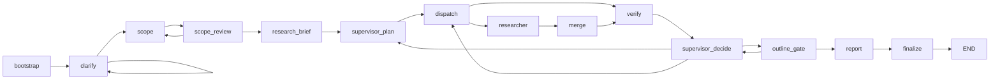

# Deep Research Multi-Agent 架构分析

更新日期：2026-04-02

## 1. 分析结论

当前 Deep Research 已经是一个真正的 LangGraph 子图运行时，而不是“单节点里手写循环”。它的核心协作模式不是 agent 直接互发消息，而是：

1. `scope_review` 批准后先生成权威 `research_brief`
2. `supervisor_plan` 基于 `research_brief` 和 ledgers 生成任务
3. `dispatch` 把任务 fan-out 给 `researcher`
4. `merge` 把 worker 结果写回黑板
5. `verify` 基于黑板做 claim/coverage 校验，并生成结构化验证 artifacts
6. `supervisor_decide` 读取 brief / ledgers / verification artifacts，决定 retry / replan / outline / report / stop
7. `outline_gate` 在最终报告前固定结构
8. `report` 只消费 outline + 已验证 branch synthesis

因此，这套架构本质上是“图驱动 + 任务队列 + artifact blackboard + 受限角色 agent”。

## 2. 运行边界

### 显式事实

- Deep Research 对外入口是 `deep_research_node()`。
- `deep_research_node()` 调用 `run_deep_research()`。
- `run_deep_research()` 只允许 `multi_agent` runtime，并进入 `MultiAgentDeepResearchRuntime.run()`。
- `MultiAgentDeepResearchRuntime.build_graph()` 会编译独立子图。

### 重要含义

- 外层 graph 看到的是单个 `deep_research` 节点。
- Deep Research 内部自己再维护一张更细的 agent fabric 图。
- checkpoint / resume / SSE 都能围绕同一个子图状态工作。

## 3. 子图全流程

### 节点职责

| 节点 | 类型 | 职责 |
| --- | --- | --- |
| `bootstrap` | runtime node | 恢复 checkpoint、重建根 branch brief、恢复 next step |
| `clarify` | agent role | 判断 intake 是否足够，必要时中断向用户追问 |
| `scope` | agent role | 生成结构化 scope draft |
| `scope_review` | HITL gate | 等待用户批准或要求重写 scope |
| `research_brief` | runtime node | 把 approved scope 归一化为 `research_brief`，初始化 ledgers |
| `supervisor_plan` | agent role | 把 `research_brief` 转成 branch task 和 branch brief |
| `dispatch` | runtime node | 根据预算和并发限制 claim ready task，并 fan-out 给 researcher |
| `researcher` | agent role | 执行 branch research，产出证据和 synthesis |
| `merge` | runtime node | 把 worker result 合并回 shared state、task queue、artifact store |
| `verify` | agent role + verifier pipeline | 先做 claim_check，再做 coverage_check，并生成 `coverage_matrix` / `contradiction_registry` / `missing_evidence_list` |
| `supervisor_decide` | agent role | 统一决定 retry_branch / replan / dispatch / outline_gate / report / stop |
| `outline_gate` | runtime node | 只消费已验证结果，产出 `outline` 或 `outline_gap` |
| `report` | agent role | 只消费 outline + 已验证 branch synthesis，生成最终报告 |
| `finalize` | runtime node | 输出 `deep_runtime` 快照和公共 `deep_research_artifacts` |

## 4. 有哪些 agent，职责是什么

### 4.1 角色总表

| 角色 | 当前 graph 中的实现方式 | 主要职责 | 输入 | 输出 |
| --- | --- | --- | --- | --- |
| `clarify` | 专用 LLM 角色类 `DeepResearchClarifyAgent` | intake 归一化、判断是否需要追问 | 原始问题、clarify 历史 | `intake_summary`、clarify question |
| `scope` | 专用 LLM 角色类 `DeepResearchScopeAgent` | 生成或重写 scope draft | intake summary、clarify transcript、scope feedback | `ScopeDraft` |
| `supervisor` | 专用 LLM 角色类 `ResearchSupervisor` | 统一负责 plan / replan / loop decision | `research_brief`、ledgers、请求、质量信号 | `ResearchTask`、`SupervisorDecisionArtifact` |
| `researcher` | 默认走 `ResearchAgent`，可切换 bounded tool-agent | 执行 branch research，生成证据和分支结论 | `ResearchTask`、branch brief、`research_brief`、ledger 只读视图 | `ResearchSubmission`、`BranchSynthesis`、证据 artifact |
| `verifier` | 默认走 `ClaimVerifier + KnowledgeGapAnalyzer + coverage logic`，可切换 bounded tool-agent | 校验 claim、覆盖度和验收标准 | `BranchSynthesis`、evidence passages、`research_brief`、ledger 只读视图 | `VerificationResult`、结构化验证 artifacts、`CoordinationRequest` |
| `reporter` | 默认走 `ResearchReporter`，可切换 bounded tool-agent | 基于 outline 生成最终报告 | `outline`、已验证 branch synthesis | `FinalReportArtifact`、report submission |

### 4.2 两类“agent 实现”

这里要区分两件事：

- 角色存在于流程设计里
- 角色是否真的以“tool agent loop”执行

当前代码中：

- `clarify`、`scope`、`supervisor` 是专用角色类，不走通用 tool-agent loop。
- `researcher`、`verifier`、`reporter` 有两套实现：
  - 默认：专用 Python 逻辑
  - 可选：`deep_research_use_tool_agents=true` 时切 bounded tool-agent

所以“multi-agent”强调的是角色和状态机，不等于每个角色都必须是 LangChain tool-calling agent。

## 5. 每个 agent 的工具边界

### 5.1 默认实现下的工具

| 角色 | 默认工具能力 |
| --- | --- |
| `clarify` | 无外部工具，只有 LLM prompt |
| `scope` | 无外部工具，只有 LLM prompt |
| `supervisor` | 无外部工具，内部调用 `ResearchPlanner` 和 supervisor 自身的确定性决策规则 |
| `researcher` | 通过 `ResearchAgent` 调用 `_search_with_tracking()`，再由 runtime 构造 source/document/passage/card/synthesis |
| `verifier` | `ClaimVerifier`、`KnowledgeGapAnalyzer`、覆盖度规则、验收标准检查 |
| `reporter` | `ResearchReporter.generate_report()` 和 `generate_executive_summary()` |

### 5.2 tool-agent 模式下的角色 allowlist

`agent/builders/agent_factory.py` 为 Deep Research 定义了角色级 allowlist：

| 角色 | 允许的工具组 |
| --- | --- |
| `clarify` | `fabric` |
| `scope` | `fabric` |
| `supervisor` | `fabric` |
| `researcher` | `fabric` + `search` + `read` + `extract` + `synthesize` |
| `verifier` | `fabric` + `search` + `read` + `extract` |
| `reporter` | `fabric` + `synthesize` + `execute_python_code` |

工具组会展开成实际工具名：

- `search`：`browser_search`、`tavily_search`、`multi_search`
- `read`：`browser_navigate`、`browser_click`、`crawl_url`、`crawl_urls`、`sb_browser_*`
- `extract`：`sb_browser_extract_text`、`sb_browser_screenshot`、`crawl_url`、`crawl_urls`
- `reporter` 还可选 `execute_python_code`

### 5.3 fabric 工具

fabric 工具是 Deep Research 的内部黑板接口，不直接暴露整个系统能力。所有角色都先通过只读工具获取权威契约和控制面状态，再按角色边界提交结构化 bundle 或 request。

### 所有角色共享

- `fabric_get_scope`
- `fabric_get_research_brief`
- `fabric_get_task`
- `fabric_get_related_artifacts`
- `fabric_get_control_plane`

### `supervisor`

- `fabric_get_task_queue`
- `fabric_get_open_requests`

### `researcher`

- `fabric_search`
- `fabric_read`
- `fabric_extract`
- `fabric_request_follow_up`
- `fabric_submit_research_bundle`

`fabric_request_follow_up` 只允许提交以下注册过的 request type：

- `retry_branch`
- `need_counterevidence`
- `contradiction_found`
- `outline_gap`
- `blocked_by_tooling`

### `verifier`

- `fabric_search`
- `fabric_read`
- `fabric_extract`
- `fabric_challenge_summary`
- `fabric_compare_coverage`
- `fabric_analyze_coverage`
- `fabric_submit_verification_bundle`

### `reporter`

- `fabric_get_verified_branch_summaries`
- `fabric_get_outline_artifact`
- `fabric_format_report_section`
- `fabric_submit_report_bundle`

## 6. agent 间如何协作

### 6.1 协作媒介不是对话，而是三套状态载体

### 1. `ResearchTaskQueue`

负责 branch task 生命周期：

- `enqueue`
- `claim_ready_tasks`
- `update_stage`
- `update_status`
- `requeue_in_progress`

它是 `supervisor -> dispatch -> researcher` 的主下行通道。

### 2. `ArtifactStore`

负责所有结构化中间产物：

- research brief
- task ledger / progress ledger
- branch brief
- source candidate
- fetched document
- evidence passage / card
- branch synthesis
- verification result
- coverage matrix
- contradiction registry
- missing evidence list
- coordination request
- submission
- supervisor decision
- outline
- knowledge gap
- report section draft
- final report

它是所有角色共享的 blackboard。

### 3. `shared_state` / `ResearchWorkerContext`

- `shared_state` 保存 Deep Research 期间仍需回写到顶层的通用状态，比如 `scraped_content`、`summary_notes`、`sources`、`errors`。
- `ResearchWorkerContext` 是 branch worker 的隔离上下文。
- `merge_research_worker_context()` 把 worker 结果回并到共享状态。

### 6.2 协作模式

### `supervisor -> researcher`

- `supervisor_plan` 把 `research_brief` 翻译为 `ResearchTask`
- `dispatch` claim ready task
- LangGraph 通过 `Send("researcher", {"worker_task": payload})` fan-out 给多个 researcher

### `researcher -> verifier`

- researcher 不直接调用 verifier
- researcher 只把结果写成 artifact 和 submission
- `merge` 把这些结果持久化后，`verify` 节点统一读取黑板执行校验

### `verifier -> supervisor`

- verifier 不直接改写任务队列
- verifier 通过 `CoordinationRequest` 上报：
  - `retry_branch`
  - `need_counterevidence`
  - `contradiction_found`
  - `blocked_by_tooling`
- `supervisor_decide` 再结合 `coverage_matrix`、`contradiction_registry`、`missing_evidence_list` 和 open requests 做统一决策

### `supervisor -> outline_gate -> report`

- 当 `supervisor_decide` 判断事实层面已满足写作前提时，先路由到 `outline_gate`
- `outline_gate` 只消费已验证 `BranchSynthesis` 与结构化验证 artifacts，生成 `outline`，或写入 `outline_gap` request 并返回 `supervisor_decide`
- `report` 只在 `outline.is_ready=true` 且不存在阻塞性 `outline_gap` 时消费 outline + 已验证 `BranchSynthesis`

### 人类用户 -> agent fabric

- `clarify` 可以 `interrupt()` 向用户追问
- `scope_review` 可以 `interrupt()` 等待用户批准 scope 或给自然语言修改意见
- 这两个中断点构成 Deep Research 的前置门控

## 7. 关键产物

| 产物 | 谁生成 | 谁消费 | 用途 |
| --- | --- | --- | --- |
| `BranchBrief` | `supervisor_plan` | `researcher`、UI | 描述 branch 的主题、目标和边界 |
| `ResearchBriefArtifact` | `research_brief` | `supervisor_plan`、`researcher`、`verifier`、`outline_gate` | approved scope 的唯一机器契约 |
| `TaskLedgerArtifact` | `research_brief` 初始化，`supervisor` 持续更新 | `supervisor`、UI、恢复逻辑 | 记录 branch 目标、coverage target、依赖与状态 |
| `ProgressLedgerArtifact` | `research_brief` 初始化，`supervisor` 持续更新 | `supervisor`、UI、恢复逻辑 | 记录当前 phase、决策历史、未决 request 与停止原因 |
| `ResearchTask` | `supervisor_plan` | `dispatch`、`researcher` | 可调度工作单元 |
| `SourceCandidate` | `researcher` 或 verifier tool-agent | `reporter`、公共 artifacts | 候选来源 |
| `FetchedDocument` | `researcher` 或 verifier tool-agent | verifier、公共 artifacts | 已抓取正文 |
| `EvidencePassage` | `researcher` 或 verifier tool-agent | `ClaimVerifier`、公共 artifacts | 可引用证据片段 |
| `EvidenceCard` | `researcher` 或 verifier tool-agent | UI、公共 artifacts | 紧凑证据摘要 |
| `BranchSynthesis` | `researcher` | `verify`、`outline_gate`、`report` | 分支级结论 |
| `VerificationResult` | `verify` | `supervisor_decide`、`report` | claim/coverage 校验结果 |
| `CoverageMatrixArtifact` | `verify` | `supervisor_decide`、`outline_gate`、`report` | 显式记录各维度覆盖状态 |
| `ContradictionRegistryArtifact` | `verify` | `supervisor_decide`、`outline_gate`、`report` | 显式记录冲突 claim、来源与建议动作 |
| `MissingEvidenceListArtifact` | `verify` | `supervisor_decide`、`outline_gate`、`report` | 记录仍缺失的证据与受影响结论 |
| `CoordinationRequest` | `researcher` / `verify` / `outline_gate` | `supervisor_decide` | 上行请求信号，只允许 5 个注册类型 |
| `ResearchSubmission` | `researcher` / `verify` / `reporter` | `ArtifactStore`、UI | 结构化提交记录 |
| `SupervisorDecisionArtifact` | `supervisor_plan` / `supervisor_decide` | UI、恢复逻辑 | 记录控制面决策 |
| `OutlineArtifact` | `outline_gate` | `report`、`finalize`、恢复逻辑 | 固定最终报告章节结构与结构缺口状态 |
| `KnowledgeGap` | `verify` | `supervisor_plan` | 覆盖分析器的中间 gap 结果 |
| `ReportSectionDraft` | `researcher` | `report` | 分支汇总的候选章节 |
| `FinalReportArtifact` | `report` | `finalize`、SessionManager、API | 最终报告 |
| `AgentRunRecord` | runtime | 观测、恢复、统计 | 记录 agent 运行轨迹 |

## 8. 产物如何在 agent 间交换

### 8.1 交换主路径

1. `clarify` 把 intake 结果写进 `runtime_state.intake_summary`
2. `scope` 把 scope draft 写进 `runtime_state.current_scope_draft`
3. `scope_review` 批准后把 scope 写进 `runtime_state.approved_scope_draft`
4. `research_brief` 把 approved scope 归一化为 `ResearchBriefArtifact`，并初始化：
   - `ArtifactStore.research_brief`
   - `ArtifactStore.task_ledger`
   - `ArtifactStore.progress_ledger`
5. `supervisor_plan` 读取 `research_brief`，写入：
   - `ResearchTaskQueue`
   - `ArtifactStore.branch_briefs`
   - `ArtifactStore.task_ledger`
   - `ArtifactStore.progress_ledger`
   - `SupervisorDecisionArtifact`
6. `dispatch` 从队列 claim task，并把 `worker_task` payload 通过 `Send` 传给 researcher
7. `researcher` 读取：
   - 当前 task
   - `research_brief`
   - branch brief
   - related artifacts / control plane
   然后产出 `WorkerExecutionResult`
8. `merge` 把 `WorkerExecutionResult` 拆开并写回：
   - `shared_state`
   - `ArtifactStore`
   - `ResearchTaskQueue`
9. `verify` 读取 `BranchSynthesis`、`EvidencePassage`、`research_brief` 与 ledgers，写入：
   - `VerificationResult`
   - `CoverageMatrixArtifact`
   - `ContradictionRegistryArtifact`
   - `MissingEvidenceListArtifact`
   - `CoordinationRequest`
   - verification submission
10. `supervisor_decide` 读取 open requests、queue stats、verification artifacts、outline 状态和 ledgers，产出：
   - request 状态更新
   - retry task requeue
   - `ArtifactStore.task_ledger`
   - `ArtifactStore.progress_ledger`
   - `SupervisorDecisionArtifact`
11. `outline_gate` 读取已验证 `BranchSynthesis` 与验证 artifacts，写入：
   - `OutlineArtifact`
   - 可选 `CoordinationRequest(outline_gap)`
12. `report` 只读取 outline + 双重通过验证的 syntheses，写入：
   - `FinalReportArtifact`
   - report submission
13. `finalize` 把内部快照收束为：
   - `deep_runtime`
   - `deep_research_artifacts`
   - `research_topology`
   - `quality_summary`

### 8.2 交换媒介总结

| 交换类型 | 媒介 |
| --- | --- |
| 控制流下发 | `next_step`、`planning_mode`、`ResearchTaskQueue` |
| 并行 fan-out | LangGraph `Send(...)` |
| 分支结果回收 | `worker_results` + `merge` 节点 |
| 结构化数据共享 | `ArtifactStore` |
| 顶层兼容状态同步 | `shared_state` + `merge_research_worker_context()` |
| 对用户中断 | `interrupt()` |
| 对前端可观测性 | `RESEARCH_*` 事件 |

## 9. 关键观测点

Deep Research 会持续发出结构化事件：

- `research_agent_start`
- `research_agent_complete`
- `research_task_update`
- `research_artifact_update`
- `research_decision`
- `quality_update`
- `deep_research_topology_update`

这使前端可以区分：

- `clarify`
- `scope`
- `scope_review`
- `research_brief`
- `supervisor`
- `research`
- `verify`
- `outline_gate`
- `report`

而不是只能看到一个“Deep Research 正在运行”的黑盒状态。

## 10. 最终产物如何离开子图

`finalize` 节点会生成两层输出：

### 内部恢复层

- `deep_runtime`
  - `task_queue`
  - `artifact_store`
  - `runtime_state`
  - `agent_runs`

### 对外消费层

- `deep_research_artifacts`
  - `queries`
  - `research_topology`
  - `quality_summary`
  - `fetched_pages`
  - `passages`
  - `sources`
  - `claims`
  - `research_brief`
  - `task_ledger`
  - `progress_ledger`
  - `coverage_matrix`
  - `contradiction_registry`
  - `missing_evidence_list`
  - `outline`
  - `coordination_requests`
  - `final_report`
  - `executive_summary`
  - `executive_summary`

`common/session_manager.py` 和 API 层后续读取的是第二层公共形态，而不是直接把内部 `ArtifactStore` 暴露出去。

## 11. 关键观察

### 显式事实

- 当前 multi-agent 的核心协作机制是“任务队列 + blackboard + 决策 artifact”，不是 agent 之间直接会话。
- `supervisor` 是唯一控制面角色，`researcher/verifier/reporter` 都是受限执行器。
- `report` 严格只消费已验证 branch synthesis，这一点对最终报告可信度很关键。

### 推断

- 这套结构比自由自治 agent network 更可测试、更容易 checkpoint/resume，也更容易把 SSE 事件和前端 UI 对齐。
- 设计明显偏向“工程可控性”和“产物可追踪性”，而不是追求最大化自治。
