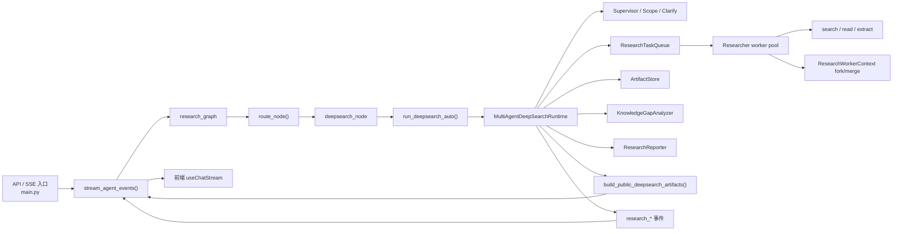

# Weaver Deep Research Multi-Agent 架构分析

基于当前仓库实现的静态分析，时间点为 2026-04-01。

> 当前仓库中，Deep Research 已只保留 `multi_agent` runtime。legacy tree/linear runtime、selector 和 `agent.workflows.deepsearch_*` compatibility facade 已移除。

本文聚焦当前 Deep Research 的唯一受支持实现，而不是整个仓库或所有 Agent 模式。

为避免把设计目标和实际实现混在一起，本文统一使用两类结论：

- `事实`：可直接从代码、配置、规格或测试证明
- `推断`：基于当前模块组合方式得出的工程判断

## 1. 分析范围

- 入口与图级编排：
  - `main.py`
  - `agent/core/graph.py`
  - `agent/workflows/nodes.py`
  - `agent/runtime/deep/entrypoints.py`
- Multi-agent 运行时内核：
  - `agent/runtime/deep/multi_agent/graph.py`
  - `agent/runtime/deep/multi_agent/runtime.py`
  - `agent/runtime/deep/public_artifacts.py`
  - `agent/core/context.py`
  - `agent/core/state.py`
- 角色代理实现：
  - `agent/workflows/agents/supervisor.py`
  - `agent/workflows/agents/researcher.py`
  - `agent/workflows/agents/reporter.py`
  - `agent/workflows/agents/scope.py`
  - `agent/workflows/agents/clarify.py`
- 支撑能力：
  - `agent/workflows/knowledge_gap.py`
  - `agent/workflows/domain_router.py`
  - `agent/core/events.py`
- 前端与规格契约：
  - `web/hooks/useChatStream.ts`
  - `openspec/changes/remove-legacy-deep-research/specs/**/*.md`
  - `tests/test_deepsearch_multi_agent_runtime.py`
  - `tests/test_chat_sse_multi_agent_events.py`

## 2. 架构概览

- `事实`：Deep Research 的图级入口仍然是单个 `deepsearch_node`，由它完成入口事件、取消检查、简单问题短路和统一收尾。
- `事实`：`run_deepsearch_auto()` 现在只会校验输入并委托 `multi_agent` runtime，不再做 engine 选择，也不会回退到 legacy。
- `事实`：已移除 `deepsearch_engine=legacy`、`deepsearch_mode`、`tree_parallel_branches`、`deepsearch_tree_max_searches` 等旧输入；调用方传入会收到显式迁移错误。
- `推断`：当前系统的 multi-agent 更准确地说是“内嵌在 Deep Research 节点里的专用 LangGraph runtime”，而不是“整个后端图已经全面多代理化”。

### 2.1 高层结构图

## 3. 模块地图

| 模块 | 角色 | 主要职责 |
| --- | --- | --- |
| `main.py` | 入口壳 | 归一化 Deep Research 输入、构建初始状态、翻译流式事件 |
| `agent/workflows/nodes.py` | Deep Research 节点壳 | 发 `research_node_start`、简单问题短路、委托 `run_deepsearch_auto()` |
| `agent/runtime/deep/entrypoints.py` | 稳定入口 | 校验旧输入已废弃，并把请求交给唯一受支持的 runtime |
| `agent/runtime/deep/multi_agent/graph.py` | 运行时内核 | 管预算、任务队列、产物仓、worker 并发、agent run 记录、最终结果回填 |
| `agent/runtime/deep/public_artifacts.py` | 公开契约适配层 | 从内部 `task_queue` / `artifact_store` / `final_report` 生成公开 `deepsearch_artifacts` |
| `common/session_manager.py` | Session 消费方 | 读取公开 artifacts 视图，不再二次拼装 legacy 风格结果 |
| `web/hooks/useChatStream.ts` | 前端事件消费 | 直接基于 `supervisor` / `researcher` / `verifier` / `reporter` 渲染进度 |

## 4. 依赖方向

- `事实`：`deepsearch_node()` 不关心 runtime 内部角色编排，只依赖稳定入口。
- `事实`：`MultiAgentDeepSearchRuntime` 是真正的控制平面，直接依赖 clarify、scope、supervisor、researcher、verifier、reporter 六类角色。
- `事实`：公开 `deepsearch_artifacts` 已从 runtime 内部快照派生，不再通过 session 或 API 层重新解析自由文本生成第二份事实源。
- `推断`：Deep Research 当前的模块边界已经从“工作流兼容层 + 多条旧路径”收敛为“单一 runtime + 显式 facade/shared contracts”。

## 5. 运行时主循环

1. `run_deepsearch_auto()` 校验输入中不存在 legacy engine / mode / tree 配置。
2. `MultiAgentDeepSearchRuntime` 初始化 topic、thread_id、预算参数、provider profile、任务队列、产物仓和角色对象。
3. runtime 先完成 clarify / scope / scope review，再由 supervisor 生成初始计划。
4. `ResearchTaskQueue` 调度 ready 任务，researcher worker 并发执行查询与总结。
5. runtime 合并 worker 结果，写入 artifact store，并通过 verifier 做 coverage / gap 分析。
6. supervisor 决定继续 dispatch、retry、replan 或 report。
7. reporter 生成最终报告，`build_public_deepsearch_artifacts()` 同步产出公开 artifacts 视图。

## 6. 公开契约

- `事实`：客户端消费的公开对象仍保留 `sources`、`fetched_pages`、`passages`、`claims`、`quality_summary`、`final_report` 等字段。
- `事实`：这些字段现在来自 `multi_agent` 记录的结构化产物，而不是 legacy verifier 的二次回填。
- `事实`：公开事件角色已经统一到 `supervisor`、`researcher`、`verifier`、`reporter`，不再暴露 `planner` / `coordinator` 别名。

## 7. 工程结论

- `事实`：当前 Deep Research 已不存在运行时级别的双轨实现。
- `事实`：外围模块应通过 `agent.runtime.deep` 或 `agent.runtime.deep.multi_agent` 的公开入口访问能力，不应依赖 `agent.workflows.*` 内部路径。
- `推断`：后续演进重点应放在 `multi_agent` runtime 内部角色、预算和 artifacts 契约上，而不是继续维护兼容 facade。
