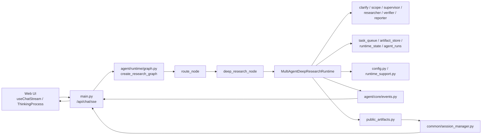
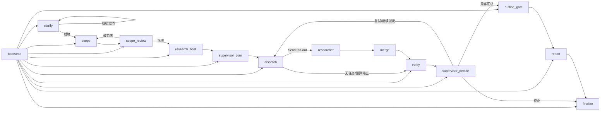

# 当前 Deep Research 多智能体架构分析

## 分析范围

- 本文只分析当前仓库中已经接入主执行路径的 Deep Research 多智能体实现。
- 重点覆盖入口路由、LangGraph 运行时、角色职责、状态/Artifact 模型、SSE 事件契约、会话恢复。
- 未逐个展开底层搜索 provider、浏览器工具、MCP 细节，也未解读全部 prompt 文本。

## 一句话结论

- 显式事实：当前 Deep Research 只有一个受支持运行时，即 `multi_agent`；旧的 runtime/mode 选择已在代码中标记为 2026-04-01 移除。
- 显式事实：这里的“多智能体”不是多进程或多服务编排，而是在单个 LangGraph 状态机里，用多个角色化 LLM 代理加 `Send` 扇出多个 `researcher` 分支。
- 推断：整体架构更接近“带控制平面的模块化单体 + 图工作流编排”，不是微服务式 agent swarm。这个推断置信度高。

## 关键证据文件

- 入口与总图：`main.py`、`agent/runtime/graph.py`、`agent/runtime/nodes/routing.py`
- Deep Research 桥接节点：`agent/runtime/nodes/deep_research.py`
- Deep Research 主运行时：`agent/runtime/deep/orchestration/graph.py`
- 角色实现：`agent/runtime/deep/roles/clarify.py`、`scope.py`、`supervisor.py`、`researcher.py`、`reporter.py`
- 状态与契约：`agent/runtime/deep/state.py`、`schema.py`、`store.py`、`support/graph_helpers.py`
- 支撑能力：`agent/runtime/deep/config.py`、`support/runtime_support.py`
- 公共产物与恢复：`agent/runtime/deep/artifacts/public_artifacts.py`、`common/session_manager.py`
- 前端消费：`web/hooks/useChatStream.ts`、`web/lib/deep-research-timeline.ts`
- 代表性测试：`tests/test_deepsearch_multi_agent_runtime.py`、`tests/test_session_deepsearch_artifacts.py`、`tests/test_resume_session_deepsearch.py`

## 模块地图

- `main.py`
  - 提供 `/api/chat`、`/api/chat/sse`、`/api/sessions/*` 等入口。
  - 把 LangGraph 事件和内部 `EventEmitter` 事件转成 SSE，送给前端。

- `agent/runtime/graph.py`
  - 定义整个研究图的总入口。
  - 通过 `route_node` 把请求路由到 `agent`、`clarify` 或 `deep_research`。

- `agent/runtime/nodes/deep_research.py`
  - 只是 Deep Research 的桥接层，不承载主业务逻辑。
  - 负责发出 `RESEARCH_NODE_START/COMPLETE` 等外层事件，并调用真正的 deep runtime。
  - 对简单事实型 deep query 有一条降级直通逻辑，会直接回到普通 `agent_node`。

- `agent/runtime/deep/orchestration/graph.py`
  - 当前 Deep Research 的核心。
  - 内含 `MultiAgentDeepResearchRuntime`，负责创建角色代理、维护状态、构建 LangGraph、执行循环。

- `agent/runtime/deep/roles/*`
  - `clarify`：补足 intake 信息。
  - `scope`：生成/重写 scope draft。
  - `supervisor`：拆计划、决定是否继续派发、重试还是收敛。
  - `researcher`：执行搜索并生成 branch summary。
  - `reporter`：把通过验证的 branch 汇总成最终报告。
  - `verifier` 当前并不是独立 role 文件，而是由 `KnowledgeGapAnalyzer` 驱动。

- `agent/runtime/deep/artifacts/public_artifacts.py`
  - 把 runtime 内部快照投影为对外稳定的 `deep_research_artifacts`。
  - 会话恢复、会话详情、前端查看都依赖这个公共视图。

- `web/hooks/useChatStream.ts` 与 `web/lib/deep-research-timeline.ts`
  - 消费结构化 Deep Research SSE 事件。
  - 把底层事件投影成前端的阶段视图和自动状态文案。

## 模块依赖关系

## 当前运行图

`agent/runtime/deep/orchestration/graph.py` 顶部注释已经给出当前 canonical loop，和实际 `build_graph()` 一致：

## 角色职责与控制平面

- `clarify`
  - 调用 `DeepResearchClarifyAgent.assess_intake()`。
  - 产出 `intake_summary`、是否需要用户补充信息、下一轮澄清问题。
  - 当 `allow_interrupts=true` 时，会通过 `interrupt()` 触发 `deep_research_clarify` 检查点。

- `scope`
  - 调用 `DeepResearchScopeAgent.create_scope()` 生成结构化范围草案。
  - 草案包含 `research_goal`、`core_questions`、`in_scope`、`out_of_scope`、`constraints`、`source_preferences`、`research_steps` 等字段。
  - scope 不是一次性结果，而是支持 revision 的版本化草案。

- `supervisor`
  - 初始职责是 `create_plan()`，把 scope 拆成多个 branch task。
  - 循环中承担调度决策，决定继续 `dispatch`、重试 branch、进入 `report` 或停止。
  - 当前主图里 `supervisor_decide` 并没有调用 `ResearchSupervisor.decide_next_action()` 做复杂结构化裁决，而是直接依据 validation 聚合结果和预算规则做决策。这是显式事实。

- `researcher`
  - 每个 branch 对应一个 researcher 执行单元。
  - 通过 `dispatch -> Send("researcher", ...)` 扇出并行分支。
  - 当前主路径只做两件事：搜索 `execute_queries()`，再汇总 `summarize_findings()`。
  - `ResearchAgent.analyze_and_select()` 虽然存在，但 `_researcher_node()` 当前没有调用它。这是显式事实。

- `verifier`
  - 当前主路径使用的是 `KnowledgeGapAnalyzer`。
  - 它基于 branch summary 和已执行 query 生成 coverage/gap 建议，产出轻量 `validation_summary`。
  - `knowledge_gap.py` 文件内已明确写明这是 advisory only，不是 authoritative verification gate。

- `reporter`
  - 只汇总通过验证的 branch。
  - 先生成 markdown 报告，再做 `normalize_report()` 补充标准化 citation/source 区段，最后生成 executive summary。

## 状态分层

当前 runtime 的状态不是一坨 dict，而是 5 组职责相对清晰的切片：

| 状态块 | 当前用途 | 典型内容 |
| --- | --- | --- |
| `shared_state` | 跨 branch 的共享研究上下文 | `scraped_content`、`summary_notes`、`sources`、`errors`、`sub_agent_contexts` |
| `task_queue` | branch 调度平面 | `ResearchTaskQueue` 快照、任务状态统计 |
| `artifact_store` | 轻量研究产物存储 | `scope`、`plan`、`evidence_bundles`、`branch_results`、`validation_summaries`、`final_report` |
| `runtime_state` | 控制平面与预算/恢复信息 | `phase`、`active_agent`、`intake_status`、`approved_scope_draft`、`searches_used`、`tokens_used`、`budget_stop_reason` |
| `agent_runs` | 代理生命周期审计轨迹 | 每次角色启动/完成的记录 |

### 轻量 ArtifactStore 是当前主路径

- 显式事实：主图实际使用的是 `LightweightArtifactStore`，不是 `store.py` 里的完整 `ArtifactStore`。
- 轻量版只保留当前主路径真正需要的 6 类产物：
  - `scope`
  - `plan`
  - `evidence_bundles`
  - `branch_results`
  - `validation_summaries`
  - `final_report`

### 任务队列的关键约束

- `ResearchTaskQueue.claim_ready_tasks()` 会按优先级认领 ready 任务。
- 同一次 claim 会避免同一 `branch_id` 被并行重复领取。
- `parallel_workers` 决定本轮最多派发多少个 researcher。
- 失败任务在未触发预算停止且未超过 `task_retry_limit` 时会回到 ready。

## 端到端执行流

1. `route_node` 先做智能路由。
   - 结果为 `deep` 时，总图进入 `deep_research` 节点。
   - 若开启 domain routing，还会附带 `domain/domain_config`。

2. `deep_research_node` 负责桥接。
   - 先发 `RESEARCH_NODE_START`。
   - 若输入被 `_auto_mode_prefers_linear()` 判定为简单事实查询，会直接回退到普通 `agent_node`。
   - 否则调用 `run_deep_research()`，真正进入多智能体 runtime。

3. `bootstrap` 负责恢复。
   - 从 `deep_runtime` 快照恢复 `task_queue`、`artifact_store`、`runtime_state`、`agent_runs`。
   - 把 checkpoint 前未完成的 `in_progress` 任务重置回 ready。

4. `clarify -> scope -> scope_review` 完成 intake 和研究范围确认。
   - `scope_review` 支持 HITL。
   - 当前明确存在两个用户中断点：`deep_research_clarify` 和 `deep_research_scope_review`。

5. `research_brief` 把获批 scope 正式写入 runtime artifact。

6. `supervisor_plan` 生成 branch task。
   - 每个 branch 都是一个 `ResearchTask`。
   - 当前计划拆分数受 `deep_research_query_num` 控制。

7. `dispatch` 扇出 researcher。
   - 使用 LangGraph `Send`，不是自己起线程或子进程。
   - 每个 researcher 带独立 `agent_id`、`task_id`、`branch_id`、`attempt`。

8. `researcher` 执行 branch 研究。
   - 先搜索，再生成 summary。
   - 产出两个主产物：`evidence_bundle` 和 `branch_result`。
   - `merge` 把结果并回共享状态，并累计 `searches_used` / `tokens_used`。

9. `verify -> supervisor_decide` 形成反馈回路。
   - verifier 为每个 branch 生成 `validation_summary`。
   - supervisor 根据 `passed/retry/failed` 聚合结果和预算决定：
     - 继续 `dispatch`
     - 重试已有 branch
     - 进入 `outline_gate/report`
     - 或直接 `finalize`

10. `report -> finalize` 收敛为对外结果。
    - reporter 只使用通过验证的 branch 生成最终报告。
    - finalize 会同时构造：
      - `final_report`
      - `quality_summary`
      - `research_topology`
      - `deep_research_artifacts`
      - `deep_runtime` 快照

## 事件流与前端消费

### 后端事件

`agent/core/events.py` 定义了当前 Deep Research 会发出的结构化事件，包括：

- `research_node_start`
- `research_node_complete`
- `deep_research_topology_update`
- `quality_update`
- `research_agent_start`
- `research_agent_complete`
- `research_task_update`
- `research_artifact_update`
- `research_decision`
- `search`

`main.py` 会把这些内部事件转成 SSE 帧；`/api/events/...` 还会把 typed SSE 降成默认 `message` 事件以兼容旧前端。

### 前端事件投影

- `web/hooks/useChatStream.ts`
  - 直接消费上述结构化事件。
  - 把事件写入 assistant message 的 process log，并生成自动状态文案。

- `web/lib/deep-research-timeline.ts`
  - 把过程事件投影为 6 个前端阶段：
    - `intake`
    - `scope`
    - `planning`
    - `branch_research`
    - `verify`
    - `report`
  - 默认会压缩/隐藏 `quality_update`、`topology_update`、`search` 等底层噪声事件，只突出可读阶段。

## 持久化与恢复

- `AgentState` 中已经有正式的 `deep_runtime` 字段。
- `read_deep_runtime_snapshot()` 会优先从这个嵌套结构恢复，而不是依赖旧的平铺字段。
- `SessionManager._extract_deep_research_artifacts()` 会优先调用 `build_public_deep_research_artifacts_from_state()`，把内部快照投影为对外稳定结构。
- 这意味着：
  - 运行时内部状态可以变化；
  - 但外部会话详情、resume API、前端恢复依赖的公共结构可以相对稳定。

### 当前已验证的恢复场景

代表性测试覆盖了以下恢复路径：

- 从 `scope_review` checkpoint 恢复
- 从 `merge` 前暂停点恢复
- 从已完成 snapshot 直接 `finalize`，不重复规划
- 从 `deep_runtime` 快照中重建 `deep_research_artifacts`

## 当前主路径之外的旁路/预留模块

下面这些模块存在，但按当前引用关系，并不在主运行图关键路径里：

- `agent/runtime/deep/store.py::ArtifactStore`
  - 是更完整的富产物存储模型。
  - 当前主图没有使用它，测试和 tool fabric 会用到。

- `agent/runtime/deep/services/verification.py`
  - 提供更重的 claim grounding / obligation / consistency 相关逻辑。
  - 当前主图的 `verify` 仍然只走 `KnowledgeGapAnalyzer` 的轻量 advisory 验证。

- `agent/runtime/deep/support/tool_agents.py`
  - 提供 bounded tool-agent/fabric 工具。
  - 当前仓库中主要被测试使用，主图没有直接接入。

- `agent/runtime/deep/orchestration/dispatcher.py`
  - 提供 tasks/briefs/claim helpers。
  - 当前主图里的计划拆分和 dispatch 逻辑仍由 `graph.py` 自己实现，没有调用这些 helper。

## 架构判断

- 显式事实：当前 Deep Research 是“一个运行时、多角色、单图编排、可恢复”的实现。
- 显式事实：真正并行的是 branch 级 `researcher` 工作单元，靠 LangGraph `Send` fan-out 实现。
- 显式事实：当前验证层还是轻量 coverage/gap 检查，不是完整 claim-level 证据裁决。
- 推断：仓库正在从“轻量 branch runtime”向“更富的 artifact/verification/tool fabric runtime”演进，但主路径还没有完全切换过去。

## 代表性实现特征

- 优点
  - 控制平面清晰，scope/HITL/resume 都是一等公民。
  - 公共 artifact 视图和内部快照解耦，便于 API 稳定。
  - 事件契约完整，前端能展示 branch、质量、拓扑和报告生成过程。

- 当前限制
  - researcher 主路径仍以搜索 + 摘要为主，`read/extract` 还更多体现为阶段语义，而非独立节点。
  - verifier 仍偏启发式，尚未把 richer verification pipeline 接入主图。
  - 图内存在一部分未接线的 richer module，说明架构还在收敛期。

## 参考文件清单

- `main.py`
- `agent/runtime/graph.py`
- `agent/runtime/nodes/deep_research.py`
- `agent/runtime/deep/orchestration/graph.py`
- `agent/runtime/deep/config.py`
- `agent/runtime/deep/state.py`
- `agent/runtime/deep/schema.py`
- `agent/runtime/deep/store.py`
- `agent/runtime/deep/support/graph_helpers.py`
- `agent/runtime/deep/support/runtime_support.py`
- `agent/runtime/deep/roles/clarify.py`
- `agent/runtime/deep/roles/scope.py`
- `agent/runtime/deep/roles/supervisor.py`
- `agent/runtime/deep/roles/researcher.py`
- `agent/runtime/deep/roles/reporter.py`
- `agent/runtime/deep/services/knowledge_gap.py`
- `agent/runtime/deep/services/verification.py`
- `agent/runtime/deep/artifacts/public_artifacts.py`
- `common/session_manager.py`
- `web/hooks/useChatStream.ts`
- `web/lib/deep-research-timeline.ts`
- `tests/test_deepsearch_multi_agent_runtime.py`
- `tests/test_session_deepsearch_artifacts.py`
- `tests/test_resume_session_deepsearch.py`
