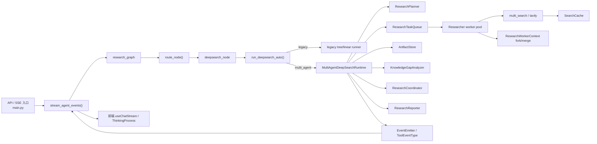
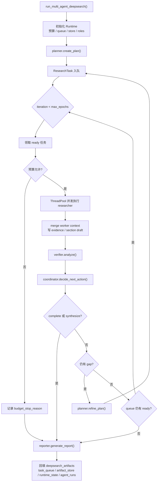

# Weaver Deep Research Multi-Agent 架构分析

基于当前仓库实现的静态分析，时间点为 2026-03-30。

本文聚焦当前 Deep Research 的 `multi_agent` 运行时，而不是整个仓库或所有 Agent 模式。

为避免把设计目标和实际实现混在一起，本文统一使用两类结论：

- `事实`：可直接从代码、配置、规格或测试证明
- `推断`：基于当前模块组合方式得出的工程判断

## 1. 分析范围

- 入口与图级编排：
  - `main.py`
  - `agent/core/graph.py`
  - `agent/workflows/nodes.py`
  - `agent/workflows/deepsearch_optimized.py`
- Multi-agent 运行时内核：
  - `agent/workflows/deepsearch_multi_agent.py`
  - `agent/core/context.py`
  - `agent/core/state.py`
- 角色代理实现：
  - `agent/workflows/agents/coordinator.py`
  - `agent/workflows/agents/planner.py`
  - `agent/workflows/agents/researcher.py`
  - `agent/workflows/agents/reporter.py`
- 支撑能力：
  - `agent/workflows/knowledge_gap.py`
  - `agent/workflows/domain_router.py`
  - `agent/workflows/search_cache.py`
  - `agent/core/events.py`
- 前端与规格契约：
  - `web/hooks/useChatStream.ts`
  - `web/components/chat/message/ThinkingProcess.tsx`
  - `openspec/specs/deep-research-orchestration/spec.md`
  - `openspec/specs/deep-research-agent-events/spec.md`
  - `tests/test_deepsearch_multi_agent_runtime.py`
  - `tests/test_chat_sse_multi_agent_events.py`

## 2. 架构概览

- `事实`：Deep Research 的图级入口仍然是单个 `deepsearch_node`，没有把 planner、researcher、verifier、reporter 拆成独立 LangGraph 节点。见 `agent/core/graph.py:57-73`、`agent/core/graph.py:86-91`、`agent/core/graph.py:227-228`。
- `事实`：当前真正的 engine 切换发生在 `run_deepsearch_auto()` 内部。它按 `deepsearch_engine` 选择 `legacy` 或 `multi_agent`，并在 `multi_agent` 失败时显式抛错，而不是回退到 legacy。见 `agent/workflows/deepsearch_optimized.py:2162-2214`。
- `事实`：默认配置仍是 `use_hierarchical_agents=false`、`deepsearch_engine="legacy"`。见 `common/config.py:283`、`common/config.py:355`。
- `推断`：当前系统的 multi-agent 更准确地说是“内嵌在 Deep Research 节点里的专用 orchestrator runtime”，不是“整个后端图已经全面多代理化”。

### 2.1 高层结构图

## 3. 模块地图

| 模块 | 角色 | 主要职责 | 关键证据 |
| --- | --- | --- | --- |
| `main.py` | 入口壳 | 归一化 `search_mode`，注入 `deepsearch_engine`，驱动 `research_graph`，把内部事件翻译成流式输出 | `main.py:709-767`、`main.py:1640-1706`、`main.py:1804-2009` |
| `agent/core/graph.py` | 图级壳 | 定义 `route -> deepsearch -> human_review` 主链路；Deep Research 默认不走图上的 coordinator/planner loop | `agent/core/graph.py:35-228` |
| `agent/workflows/nodes.py` | Deep Research 节点壳 | 发 `research_node_start`，做简单问题短路，再委托 `run_deepsearch_auto()` | `agent/workflows/nodes.py:943-1036` |
| `agent/workflows/deepsearch_optimized.py` | engine 选择器 | 统一处理 `legacy` 与 `multi_agent` engine 的切换 | `agent/workflows/deepsearch_optimized.py:2162-2214` |
| `agent/workflows/deepsearch_multi_agent.py` | 运行时内核 | 管预算、任务队列、产物仓、worker 并发、agent run 记录、最终结果回填 | `agent/workflows/deepsearch_multi_agent.py:523-1447` |
| `agent/workflows/agents/*.py` | 角色代理 | 实现 planner / researcher / verifier / coordinator / reporter 的 LLM 封装 | 各模块实现 |
| `agent/core/context.py` | 上下文隔离层 | 给 researcher worker 构造 task-scoped context，并将结果 merge 回共享 state | `agent/core/context.py:347-444` |
| `agent/core/events.py` | 事件平面 | 定义 `research_agent_* / research_task_update / research_artifact_update / research_decision` 等事件 | `agent/core/events.py:45-117` |
| `web/hooks/useChatStream.ts` | 前端事件消费 | 将 multi-agent 事件映射为自动状态文案和 thinking process 条目 | `web/hooks/useChatStream.ts:13-55`、`web/hooks/useChatStream.ts:396-410` |

## 4. 依赖方向

- `事实`：`deepsearch_node()` 是运行时壳，它不关心 planner/researcher 的内部细节，只负责入口事件、取消检查、短路分流和统一收尾。见 `agent/workflows/nodes.py:943-1036`。
- `事实`：`MultiAgentDeepSearchRuntime` 是真正的控制平面，直接依赖 planner、researcher、reporter、verifier、coordinator 五类角色。见 `agent/workflows/deepsearch_multi_agent.py:573-587`。
- `事实`：researcher worker 不是通用 tool agent，而是调用 `ResearchAgent.execute_queries()`，其底层搜索函数来自 runtime 注入的 `_search_with_tracking()`。见 `agent/workflows/deepsearch_multi_agent.py:579-584`、`agent/workflows/deepsearch_multi_agent.py:729-744`、`agent/workflows/agents/researcher.py:28-75`。
- `事实`：这套 runtime 没有走通用 `agent_factory.py` 的 middleware 栈，因此不继承 tool selector、tool retry、HITL risky tool approval 等 LangChain agent middleware 机制。见 `agent/workflows/agent_factory.py:86-206`。
- `推断`：因此，Deep Research multi-agent 和普通 `agent` 模式是两条不同的执行内核，只共享外层 API、SSE、配置和部分底层搜索能力。

## 5. 运行时主循环

### 5.1 主循环图

### 5.2 执行步骤

1. `run_multi_agent_deepsearch()` 实例化 `MultiAgentDeepSearchRuntime` 并进入 `run()`。见 `agent/workflows/deepsearch_multi_agent.py:1445-1447`。
2. runtime 初始化 topic、thread_id、emitter、预算参数、provider profile、任务队列、产物仓和五类角色对象。见 `agent/workflows/deepsearch_multi_agent.py:523-587`。
3. `_run()` 先创建根 `BranchBrief`，然后调用 `_plan_tasks(reason="initial_plan")` 生成第一批任务。见 `agent/workflows/deepsearch_multi_agent.py:600-617`。
4. 每轮循环中，runtime 先发出研究决策事件，再进入 `_dispatch_ready_tasks()`。见 `agent/workflows/deepsearch_multi_agent.py:620-638`。
5. `_dispatch_ready_tasks()` 会先做预算检查，再从 `ResearchTaskQueue` 领取若干个 `ready` 任务，并通过 `ThreadPoolExecutor` 并发执行 researcher worker。见 `agent/workflows/deepsearch_multi_agent.py:845-883`。
6. 每个 researcher worker 会：
   - 创建 task-scoped `ResearchWorkerContext`
   - 执行查询
   - 总结结果
   - 生成 `EvidenceCard`
   - 生成 `ReportSectionDraft`
   - 回传 `WorkerExecutionResult`
  见 `agent/workflows/deepsearch_multi_agent.py:885-1020`、`agent/core/context.py:347-391`。
7. runtime 通过 `_merge_worker_result()` 合并 worker 结果，更新共享 state，写入产物仓，更新任务状态，并推送研究树更新事件。见 `agent/workflows/deepsearch_multi_agent.py:1022-1063`、`agent/core/context.py:394-444`。
8. `_verify_coverage()` 调用 `KnowledgeGapAnalyzer` 生成 coverage/gap 分析和 `KnowledgeGap` 产物。见 `agent/workflows/deepsearch_multi_agent.py:1065-1105`、`agent/workflows/knowledge_gap.py:118-179`。
9. `_decide_next_action()` 调用 coordinator，根据 coverage、gap 数、citation coverage 和轮次决定继续研究、补充规划或进入汇总。见 `agent/workflows/deepsearch_multi_agent.py:1107-1150`、`agent/workflows/agents/coordinator.py:83-176`。
10. `_generate_final_result()` 由 reporter 汇总 section drafts 和 evidence，生成最终报告、执行摘要和各类 snapshot。见 `agent/workflows/deepsearch_multi_agent.py:1152-1247`、`agent/workflows/agents/reporter.py:72-110`。

## 6. 角色分工

### 6.1 Planner

- `事实`：planner 只负责生成结构化查询计划和 gap 驱动的补充计划，输出是 `{"query","aspect","priority"}` 结构。见 `agent/workflows/agents/planner.py:63-148`。
- `推断`：它更像“任务分解器”，不直接拥有任何外部工具能力。

### 6.2 Researcher

- `事实`：researcher 的执行模型是“查询批处理 + LLM 摘要”，不是一个可自由选择工具的通用 agent。见 `agent/workflows/agents/researcher.py:40-75`、`agent/workflows/agents/researcher.py:150-197`。
- `事实`：worker 并发的实际粒度是“一个 task 对应一个 query”，不是一个 researcher 内部再拆分 query fan-out。见 `agent/workflows/deepsearch_multi_agent.py:926-933`。

### 6.3 Verifier

- `事实`：verifier 直接复用 `KnowledgeGapAnalyzer`，职责是 coverage 与 gap 评估，而不是事实核验器或 citation verifier。见 `agent/workflows/deepsearch_multi_agent.py:585-586`、`agent/workflows/deepsearch_multi_agent.py:1065-1105`。
- `推断`：命名上它更接近 coverage verifier，而不是 claim-level verifier。

### 6.4 Coordinator

- `事实`：coordinator 先有一层确定性规则：
  - 到达最大轮次则 `synthesize`
  - 无 query 则 `plan`
  - 质量足够且无 gap 则 `complete`
  - 质量不足或 gap 明显则 `research`
  只有其余情况才进入 LLM 决策。见 `agent/workflows/agents/coordinator.py:102-176`。
- `推断`：这让主循环更像“规则主导、LLM 辅助”的 orchestrator，而不是完全把控制权交给模型。

### 6.5 Reporter

- `事实`：reporter 只消费 findings 和 sources，负责最终 Markdown 报告与执行摘要生成。见 `agent/workflows/agents/reporter.py:72-110`、`agent/workflows/agents/reporter.py:162-196`。
- `推断`：它不参与中间计划或证据筛选，因此是一个典型的终态汇总角色。

## 7. 控制平面、数据平面与事件平面

### 7.1 控制平面

- `事实`：控制平面由 `MultiAgentDeepSearchRuntime` 主导，关键状态包括：
  - `max_epochs`
  - `parallel_workers`
  - `max_seconds`
  - `max_tokens`
  - `max_searches`
  - `budget_stop_reason`
  见 `agent/workflows/deepsearch_multi_agent.py:535-571`。
- `事实`：任务调度由 `ResearchTaskQueue` 管理，状态流转主要有 `ready -> in_progress -> completed/failed`。见 `agent/workflows/deepsearch_multi_agent.py:377-441`。

### 7.2 数据平面

- `事实`：数据平面由 `ArtifactStore` 管理，当前一共维护五类产物：
  - `BranchBrief`
  - `EvidenceCard`
  - `KnowledgeGap`
  - `ReportSectionDraft`
  - `FinalReportArtifact`
  见 `agent/workflows/deepsearch_multi_agent.py:266-375`、`agent/workflows/deepsearch_multi_agent.py:444-520`。
- `事实`：最终结果会把 `task_queue`、`artifact_store`、`research_tree`、`quality_summary`、`runtime_state` 一并放进 `deepsearch_artifacts`，并额外复制到顶层状态字段。见 `agent/workflows/deepsearch_multi_agent.py:1193-1247`。

### 7.3 事件平面

- `事实`：Deep Research multi-agent 的关键事件类型是：
  - `research_agent_start`
  - `research_agent_complete`
  - `research_task_update`
  - `research_artifact_update`
  - `research_decision`
  - `research_tree_update`
  - `quality_update`
  - `research_node_complete`
  见 `agent/core/events.py:69-79`。
- `事实`：`stream_agent_events()` 会把这些事件统一转成流式输出，前端不需要解析内部 runtime state。见 `main.py:1955-2009`。
- `事实`：前端已经显式消费这些事件，并将其显示在状态文案和 thinking process UI 中。见 `web/hooks/useChatStream.ts:13-55`、`web/hooks/useChatStream.ts:396-410`、`web/components/chat/message/ThinkingProcess.tsx`。

## 8. Domain Routing、搜索策略与缓存

- `事实`：如果开启 `domain_routing_enabled`，`route_node()` 会在 deep/web 路径下先做 domain classification，把 `domain` 与 `domain_config` 写入状态。见 `agent/workflows/nodes.py:1108-1131`。
- `事实`：multi-agent runtime 会读取 `domain_config.suggested_sources`，再通过 `build_provider_profile()` 把源域名映射为 provider profile。见 `agent/workflows/deepsearch_multi_agent.py:106-115`、`agent/workflows/domain_router.py:313-349`。
- `事实`：researcher 实际搜索路径是：
  - 先走 `multi_search`
  - 失败时回退到 `tavily_search`
  - 结果写入进程内 `SearchCache`
  见 `agent/workflows/deepsearch_multi_agent.py:156-195`、`agent/workflows/search_cache.py:13-71`。
- `推断`：搜索层本质上还是“单一查询 API 的封装与回退”，并没有演化成独立的检索代理层。

## 9. 与 legacy deepsearch 的边界关系

- `事实`：`deepsearch_node` 入口、取消语义、最终输出契约和 SSE 壳层，对 legacy 和 multi-agent 都是复用的。见 `agent/workflows/nodes.py:943-1036`、`openspec/specs/deep-research-orchestration/spec.md:6-17`。
- `事实`：真正切换点只有 `run_deepsearch_auto()` 内部的 engine 选择。见 `agent/workflows/deepsearch_optimized.py:2205-2214`。
- `事实`：OpenSpec 明确要求 multi-agent 失败时显式报错，不得自动切回 legacy。见 `openspec/specs/deep-research-orchestration/spec.md:50-61`。
- `推断`：因此，当前架构不是“替换 legacy”，而是“在同一入口下挂两套实现”。

## 10. 工程判断

### 10.1 当前架构的优点

- `事实`：外层 API、取消、SSE、前端消费面基本不需要因 runtime 升级而重写。见 `main.py:1804-2009`、`openspec/specs/deep-research-agent-events/spec.md:31-42`。
- `事实`：任务、产物、agent run 都有显式结构化快照，调试和可视化比 legacy runner 更友好。见 `agent/workflows/deepsearch_multi_agent.py:1193-1247`。
- `事实`：researcher 并发执行已经成立，且通过队列避免同一任务被重复领取。见 `agent/workflows/deepsearch_multi_agent.py:388-401`、`agent/workflows/deepsearch_multi_agent.py:845-883`。

### 10.2 当前架构的限制

- `事实`：除了 researcher worker 以外，其余角色基本仍是串行执行，严格说是“单 orchestrator + 并发 worker”，不是完全对称的 multi-agent 协作。见 `agent/workflows/deepsearch_multi_agent.py:746-814`、`agent/workflows/deepsearch_multi_agent.py:1065-1247`。
- `事实`：五类角色都不是通用 tool agents，也没有接入 `agent_factory.py` 的通用 middleware 栈。见 `agent/workflows/deepsearch_multi_agent.py:579-587`、`agent/workflows/agent_factory.py:86-206`。
- `事实`：共享 state 仍然存在，只是通过 `ResearchWorkerContext` 对 worker 输入做了 task-scoped 收敛，而不是彻底隔离成独立 actor state。见 `agent/core/context.py:347-444`。
- `推断`：这套架构更偏“可解释工作流编排”，而不是“自治智能体群体”。

### 10.3 架构定性

- `推断`：当前 Deep Research multi-agent 最准确的描述是：
  - 外层：单 LangGraph 节点入口
  - 内层：专用 orchestrator runtime
  - 并发面：researcher worker pool
  - 数据面：显式任务队列 + 产物仓
  - 观测面：结构化事件流
- `推断`：如果后续要继续演进，这套实现更适合沿着“控制平面更强、产物契约更稳定、coverage/citation/freshness 更可观测”的方向推进，而不是急着变成多个通用 tool agents 互相对话的系统。

## 11. 规格与测试对齐

- `事实`：OpenSpec 已经把该架构的核心约束写清楚了：
  - engine 可切换
  - coordinator 控制研究循环
  - researcher 可并发执行
  - runtime 失败显式上抛
  见 `openspec/specs/deep-research-orchestration/spec.md:6-61`。
- `事实`：事件模型规格也明确要求 agent lifecycle、task progress、decision progress 与流式兼容。见 `openspec/specs/deep-research-agent-events/spec.md:6-42`。
- `事实`：测试覆盖至少证明了两件事：
  - runtime 会产出 `deepsearch_task_queue / deepsearch_artifact_store / deepsearch_agent_runs`
  - SSE 会在 graph 完成前先冲刷 multi-agent 事件
  见 `tests/test_deepsearch_multi_agent_runtime.py:92-130`、`tests/test_chat_sse_multi_agent_events.py:10-58`。

## 12. 结论

- `事实`：当前 Deep Research 的 multi-agent 已经落地为一套可运行的专用 runtime，不再只是设计稿或占位类。
- `事实`：它的默认生产路径还没有完全替代 legacy，当前仓库默认值仍然偏保守。
- `推断`：从架构形态看，它已经是“多角色工作流编排”，但还不是“全面多代理系统”。
- `推断`：这并不是缺点。对当前工程规模来说，这种“单入口壳 + 内嵌 orchestrator + 并发 researcher worker + 结构化事件/产物快照”的方案，反而比把所有角色都做成自由对话式 agent 更稳、更容易观测，也更容易继续演进。
