# Deep Research 全流程、Agent 分工与产物流转分析

本文基于仓库当前实现梳理 Deep Research 的真实执行链路，覆盖入口路由、各运行时角色的职责、阶段间协作方式、中间产物、持久化方式，以及这些数据如何传递到 checkpoint、API、SSE 和前端时间线。

## 1. 先给结论

### 1.1 显式事实

- Deep Research 的顶层入口在根图 `agent/execution/graph.py`，当 `route == "deep"` 时进入 `agent/deep_research/node.py`。
- 当前唯一支持的 Deep Research runtime 是 `multi_agent`，实际执行器是 `agent/deep_research/engine/graph.py` 中的 `MultiAgentDeepResearchRuntime`。
- 真正以类实例存在并被 runtime 直接调用的角色只有 5 个：
  - `DeepResearchClarifyAgent`
  - `DeepResearchScopeAgent`
  - `ResearchSupervisor`
  - `ResearchAgent`
  - `ResearchReporter`
- `reviewer`、`revisor` 是 runtime phase / role 名字，但当前不是独立的 agent class：
  - `reviewer` 由 `agent/deep_research/engine/review_cycle.py` + `section_review.py` 的规则逻辑实现
  - `revisor` 由 `agent/deep_research/engine/worker_flow.py` 的修订逻辑实现
- 中间产物并不是零散写在根 state 上，而是主要落在嵌套快照 `state["deep_runtime"]` 内：
  - `task_queue`
  - `artifact_store`
  - `runtime_state`
  - `agent_runs`
- 面向前端和恢复接口的 `deep_research_artifacts` 不是运行时逐步维护的一份“主存储”，而是由 `artifact_store + task_queue + runtime_state` 在 finalize 或 checkpoint 恢复时投影出来的公共视图。

### 1.2 关键判断

- 当前 Deep Research 更像“控制面 + 任务队列 + 工件存储 + 质量门控”的模块化工作流，不是自由自治的 agent swarm。
- `supervisor` 这个名字容易让人误以为它是一个强 LLM 规划者，但在当前实现里它基本是确定性控制器，主要负责：
  - 从 scope 生成 outline
  - 根据 section 状态决定继续 dispatch、进入 report，还是直接 stop
- 角色级 tool policy 已经存在，但当前 multi-agent runtime 没有真正调用 `build_deep_research_tool_agent()` 构建每个角色的 LangChain tool agent；现阶段这些 policy 主要用于：
  - 记录允许工具快照
  - 发事件
  - 暴露到运行时状态/最终产物

## 2. 入口到结束的主流程

```mermaid
flowchart LR
    A[User Query] --> B[route_node]
    B -->|route=deep| C[deep_research_node]
    C --> D[run_deep_research]
    D --> E[MultiAgentDeepResearchRuntime]

    E --> F[clarify]
    F --> G[scope]
    G --> H[scope_review]
    H --> I[research_brief]
    I --> J[outline_plan]
    J --> K[dispatch]
    K --> L[researcher / revisor]
    L --> M[merge]
    M --> N[reviewer]
    N --> O[supervisor_decide]
    O --> P[outline_gate]
    P --> Q[report]
    Q --> S[finalize]

    S --> T[deep_runtime snapshot]
    S --> U[deep_research_artifacts]
    U --> V[resume/state/evidence API]
    U --> W[SSE events]
    W --> X[web/useChatStream]
    X --> Y[deep-research-timeline]
```



## 3. 顶层入口是怎么接入 Deep Research 的

### 3.1 路由阶段

- `agent/chat/routing.py`
  - `route_node()` 先看显式 `search_mode.mode`
  - 否则调用 `smart_route()` 自动判断 `agent` 还是 `deep`
  - 如果启用了 `domain_routing_enabled`，还会进一步调用 `DomainClassifier`
  - 输出：
    - `route`
    - `domain`
    - `domain_config`

### 3.2 初始化执行 state

- `agent/execution/state.py`
  - `build_initial_agent_state()` 在 `route == "deep"` 时：
    - 将 `deep_runtime.engine` 设为支持的 runtime
    - 用 `get_deep_agent_prompt()` 作为初始 system message
    - 保留 `domain/domain_config`

### 3.3 进入 Deep Research node

- `agent/deep_research/node.py`
  - 发出 `RESEARCH_NODE_START`
  - 调用 `run_deep_research()`
  - 如果 runtime 自己没有完整发完收尾事件，它会补发：
    - `QUALITY_UPDATE`
    - `DEEP_RESEARCH_TOPOLOGY_UPDATE`
    - `RESEARCH_NODE_COMPLETE`

### 3.4 进入真正 runtime

- `agent/deep_research/entrypoints.py`
  - `run_deep_research()` 只做两件事：
    - 校验配置输入是否还在支持范围内
    - 调用 `run_multi_agent_deep_research()`

## 4. Runtime 内部的角色和真实职责

| 角色 | 真实实现位置 | 是否直接调用 LLM | 主要输入 | 主要输出 |
| --- | --- | --- | --- | --- |
| `clarify` | `agent/deep_research/agents/clarify.py` | 是 | topic, clarify transcript | `clarification_state` |
| `scope` | `agent/deep_research/agents/scope.py` | 是 | topic, clarification_state, feedback | scope payload / `ScopeDraft` |
| `supervisor` | `agent/deep_research/agents/supervisor.py` | 否，当前实现基本确定性 | approved scope, section status, aggregate summary | outline / next action |
| `researcher` | `agent/deep_research/agents/researcher.py` | 是，但只在 query refine、synthesis、claim unit 阶段 | `ResearchTask`, existing summary | evidence bundle, section draft, branch artifacts |
| `revisor` | `agent/deep_research/engine/worker_flow.py` | 否 | current draft, review artifact | revised section draft |
| `reviewer` | `agent/deep_research/engine/review_cycle.py` + `section_review.py` | 否 | section draft + evidence bundle | review artifact, certification, retry task/revision task |
| `reporter` | `agent/deep_research/agents/reporter.py` | 是 | admitted section contexts + sources | final report + executive summary |

### 4.1 哪些角色真的“像 agent”

- `clarify`、`scope`、`researcher`、`reporter` 是典型的 LLM 驱动角色。
- `supervisor` 名义上是 agent，但当前实现没有真正使用注入进来的 LLM；它更像 deterministic policy/controller。
- `reviewer`、`revisor` 是 runtime role，不是独立大模型代理。

### 4.2 工具是如何分给这些角色的

- `agent/tooling/agents/factory.py` 定义了角色允许工具白名单：
  - `clarify/scope/supervisor` 只有 `fabric`
  - `researcher` 允许 search/read/extract 类工具
  - `reporter` 允许 `fabric` 和 `execute_python_code`
- 但当前 Deep Research runtime 本身没有调用 `build_deep_research_tool_agent()`。
- 当前真实执行路径是：
  - `researcher` 通过注入的 `_search_with_tracking()` + `ContentFetcher` + RAG service 取证
  - `reporter` 直接调用 LLM 生成报告
- 因此这里的 role tool policy，当前更像“策略快照和观测数据”，不是严格的执行器装配入口。

## 5. 按阶段看协作与 handoff

### 5.1 Bootstrap / Resume

- `MultiAgentDeepResearchRuntime.__init__()`
  - 读取 `state["deep_runtime"]`
  - 恢复：
    - `graph_run_id`
    - `task_queue`
    - `artifact_store`
    - `runtime_state`
    - `agent_runs`
  - 解析运行预算：
    - `parallel_workers`
    - `max_epochs`
    - `query_num`
    - `results_per_query`
    - `max_seconds`
    - `max_tokens`
    - `max_searches`
  - 根据 `state["domain_config"]` 计算 `provider_profile`
- `build_initial_graph_state()`
  - 如果已有 checkpoint，会根据 `runtime_artifacts.initial_next_step()` 自动定位恢复节点
- `bootstrap`
  - 把 `in_progress` task 重新置回 `ready`
  - 这样恢复执行时不会丢掉尚未 merge 的 worker 任务

### 5.2 Clarify

- 入口：`intake_flow.run_clarify_step()`
- 调用：
  - `DeepResearchClarifyAgent.assess_intake()`
- 输入：
  - topic
  - `clarify_question_history`
  - `clarify_answer_history`
- 产出：
  - `runtime_state["clarification_state"]`
- 如果需要用户补充，且允许 interrupt：
  - 抛出 checkpoint `deep_research_clarify`
  - 等恢复时把答案写回 `clarify_answer_history`
- handoff：
  - clarify 不直接产出 scope，只决定“现在能不能进入 scope”

### 5.3 Scope

- 入口：`intake_flow.run_scope_step()`
- 调用：
  - `DeepResearchScopeAgent.create_scope()`
- 输入：
  - `clarification_state`
  - 已有 scope（如果是 revision）
  - `scope_feedback_history`
- 产出：
  - `runtime_state["current_scope_draft"]`
  - 一个版本化 `ScopeDraft`
- 随后进入 `scope_review`
  - checkpoint 名字：`deep_research_scope_review`
  - 用户可以：
    - `approve_scope`
    - `revise_scope`
- 批准后进入 `research_brief`
  - 把 approved scope 归一化并写入 `artifact_store.scope`

### 5.4 Outline Plan

- 入口：`planning_flow.run_outline_plan_step()`
- 调用：
  - `ResearchSupervisor.create_outline_plan()`
  - `planning.build_outline_tasks()`
- 输入：
  - approved scope
  - `artifact_store.scope`
- 产出：
  - `artifact_store.outline`
  - `artifact_store.plan`
  - `task_queue.enqueue(tasks)`
- 这里发生了第一次关键 handoff：
  - scope 面向“研究范围”
  - outline 面向“章节结构”
  - task queue 面向“可执行任务”

### 5.5 Dispatch

- 入口：`planning_flow.run_dispatch_step()`
- 行为：
  - 检查预算是否已停机
  - `claim_ready_tasks(limit=parallel_workers)`
  - 为每个 task 分配一个逻辑 `agent_id`
  - 增加 `current_iteration`
- 输出：
  - `pending_worker_tasks`
- 下一跳：
  - `task_kind == "section_revision"` -> `revisor`
  - 其他 -> `researcher`

### 5.6 Researcher

- 入口：`worker_flow.run_researcher_step()`
- 调用主对象：
  - `ResearchAgent.research_branch()`
- 这个角色内部实际上又包了一条 branch pipeline：

```mermaid
flowchart LR
    A[ResearchTask] --> B[BranchQueryPlanner.build_initial_queries]
    B --> C[search_queries]
    C --> D[rank_search_results]
    D --> E[build_documents_and_sources]
    E --> F[build_passages]
    F --> G[evaluate_coverage / quality / contradiction]
    G --> H[refine_queries / decide_next_action]
    H -->|continue| C
    H -->|synthesize| I[synthesize]
    I --> J[build_claim_units]
    J --> K[evaluate_grounding]
    K --> L[build_branch_artifacts]
```



- 真实取证来源：
  - Web search：`search_runtime._search_query()` -> `run_web_search()`
  - 知识库检索：`knowledge_service.search()`，provider 为 `milvus_rag`
  - 内容抓取：`ContentFetcher.fetch_many()`
- branch 级中间产物：
  - `query_rounds`
  - `coverage`
  - `quality`
  - `contradiction`
  - `grounding`
  - `decisions`
  - `sources`
  - `documents`
  - `passages`
  - `claim_units`
- worker 返回给 merge 的 payload：
  - `evidence_bundle`
  - `section_draft`
  - `branch_artifacts`
  - `raw_results`
  - `tokens_used`
  - `searches_used`
  - `agent_run`

### 5.7 Revisor

- 入口：`worker_flow.run_revisor_step()`
- 不是重新联网研究，而是对已有 `current_draft` 做压缩式修订：
  - 尽量保留 primary / grounded claims
  - 用 advisory issues 补充限制说明
- 返回 merge 的 payload 只有新版 `section_draft`

### 5.8 Merge

- 入口：`merge_flow.merge_worker_results()`
- 这是所有 worker 结果真正进入 runtime 主状态的地方。

它会把结果拆开写进三个地方：

1. `task_queue`
- 任务从 `in_progress` 变 `completed`
- 失败任务按 retry limit 决定是否重新回到 `ready`

2. `artifact_store`
- `evidence_bundle`
- `section_draft`
- `branch_query_rounds`
- `branch_coverage`
- `branch_quality`
- `branch_contradiction`
- `branch_grounding`
- `branch_decisions`

3. `shared_state`
- `summary_notes`
- `sources`
- `scraped_content`
- `errors`

另外还会更新：

- `runtime_state["searches_used"]`
- `runtime_state["tokens_used"]`
- `runtime_state["role_tool_policies"]`
- `runtime_state["section_status_map"]`

### 5.9 Reviewer

- 入口：`review_cycle.review_section_drafts()`
- 它会遍历 `artifact_store.section_drafts()`，对每个 draft 做静态质量门控。
- 检查维度：
  - 目标是否被回答
  - 是否有 passage / source 支撑
  - grounding ratio 是否达标
  - 是否存在 freshness 风险
  - 是否有 contradiction
- 产出：
  - `SectionReviewArtifact`
  - 如果至少可报告，还会产出 `SectionCertificationArtifact`
- reviewer 的三类结果：
  - `accept_section`
  - `revise_section`
  - `request_research`
  - 以及更严重的 `block_section`
- 它还会动态生成新的 task：
  - revision task
  - research retry task

### 5.10 Supervisor Decide / Outline Gate

- `supervisor_decide`
  - 聚合所有 section 状态
  - 判断是：
    - 继续 dispatch
    - 进入 outline gate
    - 直接 report
    - finalize 停止
- `outline_gate`
  - 检查 required sections 是否都可接受
  - 如果不完整但已有可报告章节，则允许 best-effort partial report

### 5.11 Report

- 入口：`completion_flow.build_final_report_artifact()`
- 先从 `artifact_store` 提取“允许进入报告”的 section：
  - `section_review.build_report_sections()`
- 然后：
  - `ResearchReporter.generate_report()`
  - `ResearchReporter.normalize_report()`
  - `ResearchReporter.generate_executive_summary()`
- 结果落到：
  - `artifact_store.final_report`

### 5.12 Finalize

- 入口：`completion_flow.build_finalize_outputs()`
- 这里会把内部运行态投影成最终结果：
  - `deep_runtime`
  - `final_report`
  - `quality_summary`
  - `research_topology`
  - `deep_research_artifacts`
  - `messages`
- 其中 `deep_research_artifacts` 是给外部系统消费的最关键公共视图。

## 6. 中间产物总表

| 名称 | 结构定义 | 存放位置 | 生产阶段 | 主要消费者 |
| --- | --- | --- | --- | --- |
| `clarification_state` | clarify agent 输出的普通 dict | `runtime_state` | clarify | scope |
| `current_scope_draft` / `approved_scope_draft` | `ScopeDraft` payload | `runtime_state` | scope / scope_review | research_brief |
| `scope` | scope 的 runtime 归一化版本 | `artifact_store.scope` | research_brief | outline_plan |
| `outline` | `OutlineArtifact` | `artifact_store.outline` | outline_plan | planning/review/topology |
| `plan` | `ResearchPlanArtifact` | `artifact_store.plan` | outline_plan | API/public artifacts |
| `tasks` | `ResearchTask` | `task_queue` | outline_plan / reviewer | dispatch |
| `evidence_bundle` | `EvidenceBundle` | `artifact_store.evidence_bundles` | researcher | reviewer/final claim gate/public artifacts |
| `section_draft` | `SectionDraftArtifact` | `artifact_store.section_drafts` | researcher / revisor | reviewer/reporter |
| `section_review` | `SectionReviewArtifact` | `artifact_store.section_reviews` | reviewer | supervisor/report gating |
| `section_certification` | `SectionCertificationArtifact` | `artifact_store.section_certifications` | reviewer | report gating |
| `branch_query_rounds` | `BranchQueryRoundArtifact[]` | `artifact_store.branch_query_rounds` | researcher | public artifacts |
| `branch_coverage` | `BranchCoverageArtifact` | `artifact_store.branch_coverages` | researcher | reviewer/public artifacts |
| `branch_quality` | `BranchQualityArtifact` | `artifact_store.branch_qualities` | researcher | reviewer/public artifacts |
| `branch_contradiction` | `BranchContradictionArtifact` | `artifact_store.branch_contradictions` | researcher | reviewer/public artifacts |
| `branch_grounding` | `BranchGroundingArtifact` | `artifact_store.branch_groundings` | researcher | reviewer/final claim gate/public artifacts |
| `branch_decisions` | `BranchDecisionArtifact[]` | `artifact_store.branch_decisions` | researcher | public artifacts |
| `final_report` | `FinalReportArtifact` | `artifact_store.final_report` | report | final claim gate / finalize |
| `quality_summary` | 聚合摘要 | finalize 计算 | finalize | SSE/API/frontend |
| `research_topology` | 拓扑快照 | finalize 计算 | finalize | SSE/frontend |
| `deep_research_artifacts` | 公共 payload | finalize 产出 / checkpoint 提取 | finalize / resume | API/frontend |

## 7. 数据是如何在系统里传递的

### 7.1 节点间传递

Deep Research runtime 的节点间状态通过 `MultiAgentGraphState` 传递，核心字段有：

- `shared_state`
- `task_queue`
- `artifact_store`
- `runtime_state`
- `agent_runs`
- `pending_worker_tasks`
- `worker_results`
- `final_result`

这意味着当前系统的数据流不是“每个 agent 自己保留上下文”，而是“所有 agent 读写一个受约束的 runtime state + artifact store”。

### 7.2 持久化传递

- finalize 之前，真正持久化给 LangGraph checkpointer 的核心是 `state["deep_runtime"]`
- 结构来自 `agent.foundation.state.build_deep_runtime_snapshot()`
- 恢复时：
  - `agent.deep_research.state.read_deep_runtime_snapshot()` 先读嵌套快照
  - `runtime_artifacts.initial_next_step()` 决定从哪个节点恢复
  - `bootstrap` 把在 checkpoint 时还在跑的任务重新放回 ready 队列

### 7.3 从内部产物投影成公共产物

- `completion_flow.build_finalize_outputs()`
  - 调 `build_public_deep_research_artifacts()`
- `agent/deep_research/artifacts/public_payload.py`
  - 把内部产物组装成外部稳定 payload

最终公共产物里最重要的字段包括：

- `queries`
- `scope`
- `outline`
- `plan`
- `tasks`
- `research_topology`
- `sources`
- `section_drafts`
- `section_reviews`
- `section_certifications`
- `branch_query_rounds`
- `branch_coverages`
- `branch_qualities`
- `branch_contradictions`
- `branch_groundings`
- `branch_decisions`
- `outline_gate_summary`
- `branch_results`
- `validation_summary`
- `quality_summary`
- `final_report`
- `executive_summary`
- `runtime_state`
- `fetched_pages`
- `passages`
- `query_coverage`
- `freshness_summary`
- `coverage_summary`
- `uncovered_questions`

## 8. 对外暴露链路：checkpoint、API、SSE、前端

### 8.1 Checkpoint / Resume

- `common/checkpoint_runtime.py`
  - `extract_deep_research_artifacts(state)`：从 checkpoint state 中提取公共 artifacts
  - `build_resume_state()`：恢复 state 时，把 `deep_research_artifacts` 一并塞回去

这意味着恢复接口拿到的不是生硬的内部快照，而是一份已经投影过的公共读模型。

### 8.2 API 暴露

- `main.py`
  - `/api/sessions/{thread_id}/state`
    - 返回原始 state + `deep_research_artifacts`
  - `/api/sessions/{thread_id}/evidence`
    - 重点返回 sources / outline / section_drafts / section_reviews / certifications / quality
  - `/api/sessions/{thread_id}/resume`
    - 返回可恢复状态，以及恢复前的 artifact 摘要

### 8.3 SSE 事件流

runtime 过程中会发出多类事件，`main.py` 再把它们转换成前端事件类型：

- `RESEARCH_NODE_START` -> `research_node_start`
- `RESEARCH_NODE_COMPLETE` -> `research_node_complete`
- `DEEP_RESEARCH_TOPOLOGY_UPDATE` -> `deep_research_topology_update`
- `QUALITY_UPDATE` -> `quality_update`
- `SEARCH` -> `search`
- `RESEARCH_AGENT_START` -> `research_agent_start`
- `RESEARCH_AGENT_COMPLETE` -> `research_agent_complete`
- `RESEARCH_TASK_UPDATE` -> `research_task_update`
- `RESEARCH_ARTIFACT_UPDATE` -> `research_artifact_update`
- `RESEARCH_DECISION` -> `research_decision`

### 8.4 前端消费

- `web/hooks/useChatStream.ts`
  - 把上述 SSE 事件推入统一的 `processEvents`
  - 同时刷新自动状态文案
- `web/lib/deep-research-timeline.ts`
  - 从过程事件里再投影出更稳定的时间线模型
  - phase 被归并为：
    - `intake`
    - `scope`
    - `outline`
    - `section_research`
    - `section_review`
    - `report`

所以前端看到的 Deep Research“时间线”，本质上是对 runtime 事件流的二次投影，不是后端直接维护的一份独立 timeline 数据结构。

## 9. 一个最重要的产物流转链

如果只抓一条主线，可以把 Deep Research 的核心 handoff 理解成下面这串：

```text
topic
-> clarification_state
-> current_scope_draft
-> approved_scope_draft
-> artifact_store.scope
-> artifact_store.outline
-> task_queue.tasks
-> artifact_store.evidence_bundles
-> artifact_store.section_drafts
-> artifact_store.section_reviews / section_certifications
-> artifact_store.final_report
-> deep_research_artifacts
-> state/evidence/resume API + SSE + frontend timeline
```

## 10. 最容易误解的几点

### 10.1 “multi-agent” 不等于所有角色都是独立 LLM agent

不是。当前实现里：

- 有些角色是 LLM 驱动的类
- 有些角色只是 runtime phase
- 很多关键决策是规则逻辑，不是 agent 自主协商

### 10.2 `deep_research_artifacts` 不是主存储

不是。主存储是：

- `task_queue`
- `artifact_store`
- `runtime_state`

`deep_research_artifacts` 是公共读模型。

### 10.3 Reporter 并不直接读取所有原始证据

它主要消费的是“被 reviewer 允许进入报告的 section context + source 列表”，而不是回到每个原始 search result 重新写报告。

### 10.4 最终报告后的 finalize 不再额外经过 claim gate

section 层 gate 发生在 `reviewer`；当前流程在 `report` 之后直接进入 `finalize`，不再追加独立的最终 claim gate。

## 11. 代码定位清单

如果后续要继续深挖，最值得先看的文件是这些：

- 顶层入口
  - `agent/chat/routing.py`
  - `agent/execution/state.py`
  - `agent/execution/graph.py`
  - `agent/deep_research/node.py`
  - `agent/deep_research/entrypoints.py`
- runtime 主图
  - `agent/deep_research/engine/graph.py`
- intake
  - `agent/deep_research/agents/clarify.py`
  - `agent/deep_research/agents/scope.py`
  - `agent/deep_research/engine/intake_flow.py`
- planning / dispatch
  - `agent/deep_research/agents/supervisor.py`
  - `agent/deep_research/engine/planning.py`
  - `agent/deep_research/engine/planning_flow.py`
- researcher branch pipeline
  - `agent/deep_research/agents/researcher.py`
  - `agent/deep_research/branch_research/runner.py`
  - `agent/deep_research/branch_research/planner.py`
  - `agent/deep_research/branch_research/research_pipeline.py`
  - `agent/deep_research/branch_research/artifacts.py`
- merge / review / completion
  - `agent/deep_research/engine/merge_flow.py`
  - `agent/deep_research/engine/section_review.py`
  - `agent/deep_research/engine/review_cycle.py`
  - `agent/deep_research/engine/completion_flow.py`
  - `agent/deep_research/engine/runtime_artifacts.py`
- 公共读模型与恢复
  - `agent/deep_research/artifacts/public_artifacts.py`
  - `agent/deep_research/artifacts/public_payload.py`
  - `common/checkpoint_runtime.py`
  - `main.py`
  - `web/hooks/useChatStream.ts`
  - `web/lib/deep-research-timeline.ts`
