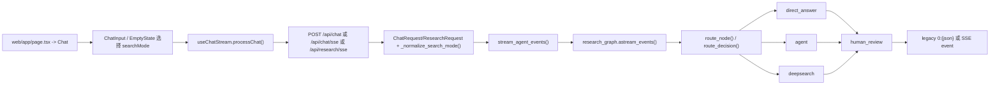

# Weaver 直接回答、Agent 模式、Deep Research 模式执行链路分析

基于当前仓库代码的静态分析，时间点为 2026-03-30。

## 分析范围

- 前端主入口与模式选择：`web/app/page.tsx`、`web/components/chat/Chat.tsx`、`web/components/chat/ChatInput.tsx`、`web/components/chat/EmptyState.tsx`
- 后端请求模型与聊天/研究入口：`main.py`
- 图级分流与节点实现：`agent/core/graph.py`、`agent/core/smart_router.py`、`agent/workflows/nodes.py`
- Agent 工具装配与中间件：`agent/workflows/agent_tools.py`、`agent/workflows/agent_factory.py`
- Deep Research runner：`agent/workflows/deepsearch_optimized.py`
- 配置默认值：`common/config.py`

## 关键结论

- `事实`：三种模式共享同一条主执行骨架：前端收集输入后调用聊天/研究接口，后端统一进入 `stream_agent_events()`，再驱动同一个 `research_graph`。`web/app/page.tsx:1-7`、`web/components/chat/Chat.tsx:24-72`、`main.py:466-470`、`main.py:1793-1990`
- `事实`：当前主页面实际使用的是字符串模式值，而不是结构化对象模式值。`Chat` 的 `searchMode` 默认是空字符串；`ChatInput` 的主 tabs 使用 `web | agent | ultra`，空字符串表示直答。`web/components/chat/Chat.tsx:27-29`、`web/components/chat/ChatInput.tsx:313-430`
- `事实`：后端会先把输入的 `search_mode` 归一成固定 `mode`，再把该 `mode` 作为 `override_mode` 传给 `smart_route()`；因此对当前公开入口来说，模式通常是“显式覆盖”，不是默认让 LLM 智能判路。`main.py:715-764`、`main.py:1634-1695`、`agent/workflows/nodes.py:1074-1086`、`agent/core/smart_router.py:317-344`
- `事实`：默认配置下，`deep` 不走图里的公共 `planner -> perform_parallel_search -> writer -> evaluator` 分支，而是直接进入 `deepsearch_node`，再由节点内部调用 `run_deepsearch_auto()`。只有 `use_hierarchical_agents=true` 时，`deep` 才会先进入 `coordinator`。`agent/core/graph.py:82-109`、`agent/core/graph.py:138-173`、`agent/core/graph.py:222-228`、`common/config.py:283`、`agent/workflows/nodes.py:943-979`
- `事实`：默认 Deep Research runner 选择策略是 `deepsearch_mode=auto` 且 `tree_exploration_enabled=true`，因此复杂主题通常走 tree runner；但简单事实型问题可能被降级到 linear runner，甚至在 `deepsearch_node` 里直接退回 `direct_answer_node()`。`common/config.py:297-355`、`agent/workflows/nodes.py:969-979`、`agent/workflows/deepsearch_optimized.py:2145-2185`
- `事实`：`/api/research` 这个专用接口名义上是研究接口，但 handler 本身没有强制 `deep`，它直接调用 `stream_agent_events(query, ...)` 且不传 `search_mode`，因此会被归一到 `direct`。`main.py:4720-4742`、`main.py:1634-1695`

## 1. 统一入口链路

### 1.1 当前生效的前端入口

- `事实`：主页只渲染 `Chat` 组件。`web/app/page.tsx:1-7`
- `事实`：`Chat` 持有 `searchMode` 状态，并把它传给 `useChatStream` 与 `ChatInput`。`web/components/chat/Chat.tsx:27-29`、`web/components/chat/Chat.tsx:56-72`
- `事实`：当前 dashboard 的模式按钮来自 `ChatInput`，不是 `SearchModeSelector`。`ChatInput` 用字符串模式值；`ChatInterface/SearchModeSelector` 仍存在，但没有被主页引用。`web/components/chat/ChatInput.tsx:313-430`、`web/components/chat/ChatInterface.tsx:24-29`
- `事实`：当前 UI 模式映射为：
  - `''` 或 `direct` -> 直答
  - `agent` -> Agent 模式
  - `ultra` -> Deep Research
  - `web` -> Web 模式
  - `mcp` -> 仍被后端归入 Agent 模式
  证据：`web/components/chat/ChatInput.tsx:313-430`、`main.py:728-742`

### 1.2 请求进入后端后的统一处理

1. `useChatStream.processChat()` 发送 `messages`、`model`、`search_mode`、`images` 到 `/api/chat`。`web/hooks/useChatStream.ts:88-113`
2. `ChatRequest` / `ResearchRequest` 的字段校验器先调用 `_coerce_search_mode_input()`，把字符串输入兼容成 `SearchMode` 对象。`main.py:709-764`、`main.py:942-968`
3. handler 再调用 `_normalize_search_mode()`，把对象、字符串或字典统一归一为：
   - `use_web`
   - `use_agent`
   - `use_deep`
   - `mode`
   - `use_deep_prompt`
   证据：`main.py:1634-1695`
4. `chat()` / `chat_sse()` / `research_sse()` 最终都调用 `stream_agent_events()`。`main.py:2332-2429`、`main.py:2432-2460`、`main.py:4745-4823`
5. `stream_agent_events()` 创建取消令牌、事件发射器、初始状态和 LangGraph `config`，再执行 `research_graph.astream_events(...)`。`main.py:1844-1990`

### 1.3 当前公开入口为什么“几乎总是显式模式覆盖”

- `事实`：`route_node()` 从 `configurable.search_mode.mode` 读取 `override_mode`。`agent/workflows/nodes.py:1074-1086`
- `事实`：`smart_route()` 在 `override_mode` 存在时，直接返回该 route，不再调用 LLM router。`agent/core/smart_router.py:337-344`
- `事实`：当前公开 handler 在进入图之前已经调用 `_normalize_search_mode()`，无论用户传空字符串、`agent`、`ultra` 还是结构化对象，最终都会带上一个确定的 `mode`；默认空模式会被归一到 `direct`。`main.py:1634-1695`

这意味着：

- `事实`：当前主页面上的直答、Agent、Deep Research，本质上都是“前端先选模式，后端按固定 route 执行”。
- `推断`：`smart_router` 更像保留能力或给其他内部调用路径使用；对当前 `Chat` 页面和公开聊天/研究接口，不是主要分流来源。

## 2. 直接回答模式执行链路

### 2.1 入口与分流

1. 前端默认 `searchMode=''`，再次点击已选 mode 也会回到空字符串。`web/components/chat/Chat.tsx:27-29`、`web/components/chat/ChatInput.tsx:362-369`
2. `EmptyState` 的 starter 也可以显式传 `direct`。`web/components/chat/EmptyState.tsx:18-39`
3. `_coerce_search_mode_input()` 把 `''` 或 `direct` 转成空 `SearchMode()`。`main.py:728-733`
4. `_normalize_search_mode()` 归一后得到 `mode='direct'`。`main.py:1658-1688`
5. `route_node()` 将 `override_mode='direct'` 传给 `smart_route()`，图上的 `route_decision()` 最终进入 `direct_answer` 节点。`agent/workflows/nodes.py:1074-1107`、`agent/core/smart_router.py:337-344`、`agent/core/graph.py:82-100`

### 2.2 节点内部执行

1. `direct_answer_node()` 构造一个简单 system prompt: “Answer succinctly and accurately.”。`agent/workflows/nodes.py:1190-1199`
2. 节点调用一次 `llm.invoke(messages, config=config)`。`agent/workflows/nodes.py:1199-1202`
3. 节点把模型输出同时写入 `draft_report`、`final_report` 和 `messages`。`agent/workflows/nodes.py:1203-1208`
4. 图继续走 `direct_answer -> human_review -> END`。`agent/core/graph.py:222-228`
5. 默认 `human_review` 只会套用输出契约并直接放行；只有开启 `allow_interrupts + human_review` 或启用 `final` checkpoint 时才会真的中断等待人工确认。`agent/workflows/nodes.py:2453-2487`

### 2.3 返回前端

- `事实`：`stream_agent_events()` 只允许 `direct_answer` 这类“最终回答节点”的 token 流进主回答气泡。`main.py:1401-1421`
- `事实`：`/api/chat` 返回的是 legacy `0:{json}\n` 协议；`/api/chat/sse` 与 `/api/research/sse` 则把它翻译成标准 SSE。`main.py:1391-1398`、`main.py:2332-2429`、`common/chat_stream_translate.py:9-35`

## 3. Agent 模式执行链路

### 3.1 入口与分流

1. 前端选择 `agent` tab，或通过 MCP 下拉把模式切到 `mcp`。`web/components/chat/ChatInput.tsx:313-430`
2. `_coerce_search_mode_input()` 会把 `agent` 和 `mcp` 都转成 `SearchMode(useAgent=True)`。`main.py:734-740`
3. `_normalize_search_mode()` 归一后得到 `mode='agent'`。`main.py:1668-1688`
4. `route_node()` 把 `override_mode='agent'` 传入 `smart_route()`，图分流到 `agent` 节点。`agent/workflows/nodes.py:1074-1107`、`agent/core/graph.py:92-94`

### 3.2 进入 Agent 运行前的装配

1. `stream_agent_events()` 会读取 `agent_id`，没有则回退到 `default` agent profile。`main.py:1817-1820`
2. 只有在 `mode == 'agent'` 时，`stream_agent_events()` 才会把 `agent_profile.system_prompt` 预先塞进初始消息。`main.py:1900-1906`
3. 应用启动时会确保存在默认 agent profile；默认 profile 开启了 `web_search`、`browser`、`crawl`、`python`、`mcp`。`main.py:582-599`

### 3.3 Agent 节点内部链路

1. `agent_node()` 先检查取消，再判断是否走“简单验证问题”的 fast path。`agent/workflows/nodes.py:1736-1745`
2. 正常路径下，节点通过 `build_agent_tools(config)` 基于 `agent_profile.enabled_tools` 动态组装工具集。`agent/workflows/nodes.py:1746-1757`、`agent/workflows/agent_tools.py:82-277`
3. `build_agent_tools()` 可按 profile 打开或关闭：
   - Web search / fallback search
   - crawl
   - browser / browser_use
   - sandbox browser/files/shell/sheets/presentation/vision/web dev
   - python / chart
   - task list
   - computer use
   - ask human
   - string replace
   - planning
   - MCP tools
   证据：`agent/workflows/agent_tools.py:110-275`
4. `agent_node()` 之后调用 `build_tool_agent(model, tools, temperature=0.7)` 创建 LangChain agent。`agent/workflows/nodes.py:1770-1771`、`agent/workflows/agent_factory.py:197-206`
5. `build_tool_agent()` 统一挂载中间件：
   - Provider-safe tool selector
   - Tool retry
   - Tool call limit
   - Context editing
   - TodoList
   - Human-in-the-loop risky tool approval
   证据：`agent/workflows/agent_factory.py:86-177`
6. `agent_node()` 组装增强版 system prompt、可选 browser context hint，再把用户消息交给 `agent.invoke({"messages": messages}, config=config)`。`agent/workflows/nodes.py:1773-1829`
7. 节点读取最后一条 AI 消息作为最终文本结果，写入 `draft_report`、`final_report`、`messages`。`agent/workflows/nodes.py:1831-1874`
8. 图继续走 `agent -> human_review -> END`。`agent/core/graph.py:223-228`

### 3.4 Agent 模式的可中断点

- `事实`：如果工具命中 `HumanInTheLoopMiddleware` 的审批规则，流里会发出 interrupt 事件。`agent/workflows/agent_factory.py:149-175`、`web/hooks/useChatStream.ts:239-256`
- `事实`：前端调用 `/api/interrupt/resume` 继续执行。`web/hooks/useChatStream.ts:454-498`、`main.py:2576-2577`

## 4. Deep Research 模式执行链路

### 4.1 入口与分流

1. 当前主页面的 Deep Research tab 实际模式字符串是 `ultra`。`web/components/chat/ChatInput.tsx:313-321`
2. `_coerce_search_mode_input()` 把 `ultra | deep | deep_agent | deep-agent` 统一转为 `SearchMode(useAgent=True, useDeepSearch=True)`。`main.py:737-740`
3. `_normalize_search_mode()` 归一后得到 `mode='deep'`。`main.py:1668-1688`
4. `route_node()` 将 `override_mode='deep'` 传给 `smart_route()`；默认图里 `route_decision()` 直接进入 `deepsearch` 节点。`agent/workflows/nodes.py:1074-1107`、`agent/core/graph.py:86-91`
5. `例外`：如果 `use_hierarchical_agents=true`，`deep` 不会直接进 `deepsearch`，而是先进入 `coordinator`，再决定是否走 `planner` / `writer` / `human_review`。默认该配置为 `false`。`agent/core/graph.py:75-78`、`agent/core/graph.py:86-89`、`common/config.py:283`

### 4.2 `deepsearch_node()` 的第一层控制

1. 节点先发 `research_node_start` 事件。`agent/workflows/nodes.py:943-968`
2. 如果输入是“简单事实型 deep 问题”，节点不会真的运行 deepsearch，而是直接委托给 `direct_answer_node()`。`agent/workflows/nodes.py:969-973`
3. 否则节点调用 `run_deepsearch_auto(state, config)`。`agent/workflows/nodes.py:975-979`
4. runner 返回后，节点会补发：
   - `quality_update`
   - `research_tree_update`
   - `research_node_complete`
   证据：`agent/workflows/nodes.py:980-1036`
5. 图继续走 `deepsearch -> human_review -> END`。`agent/core/graph.py:227-228`

### 4.3 `run_deepsearch_auto()` 的分派规则

1. 优先级：
   - `configurable.deepsearch_mode`
   - `settings.deepsearch_mode`
   - `auto`
   证据：`agent/workflows/deepsearch_optimized.py:144-164`
2. 若显式指定 `tree` 或 `linear`，直接命中对应 runner。`agent/workflows/deepsearch_optimized.py:2159-2165`
3. `auto` 模式下：
   - 若 `tree_exploration_enabled=true` 且问题足够简单，自动降级到 linear，并把预算压缩为 1 epoch、1 query。`agent/workflows/deepsearch_optimized.py:2167-2179`
   - 否则优先走 tree runner。`agent/workflows/deepsearch_optimized.py:2180-2185`
4. 默认配置是：
   - `tree_exploration_enabled=true`
   - `deepsearch_mode=auto`
   证据：`common/config.py:297-355`

### 4.4 Linear runner 执行链路

`run_deepsearch_optimized()` 是一个 epoch 循环式深搜流程。`agent/workflows/deepsearch_optimized.py:1011-1629`

单个 epoch 的主步骤如下：

1. 生成查询  
   `_generate_queries()` 根据主题、已有查询、已有摘要和可选 `missing_topics` 生成本轮 query 列表。`agent/workflows/deepsearch_optimized.py:1117-1135`
2. 搜索并发射搜索事件  
   对每个 query 调用 `_search_query()`，累计 `search_runs`，并发出 `search` 事件。`agent/workflows/deepsearch_optimized.py:1137-1200`
3. 选择最相关 URL  
   `_pick_relevant_urls()` 基于研究主题和已有总结挑选 top URLs，且排除已处理 URL。`agent/workflows/deepsearch_optimized.py:1258-1348`
4. 可选 crawler 增强  
   若 `deepsearch_enable_crawler=true`，执行 `_hydrate_with_crawler()`。`agent/workflows/deepsearch_optimized.py:1350-1357`
5. 摘要新知识  
   `_summarize_new_knowledge()` 输出新摘要，并判断当前信息是否已经足够。`agent/workflows/deepsearch_optimized.py:1359-1383`
6. 可选知识空白分析  
   若启用 `deepsearch_use_gap_analysis` 且本轮仍不够，会用 `KnowledgeGapAnalyzer` 计算缺口，并把高优先级缺口写回 `state["missing_topics"]` 供下一轮 query generation 使用。`agent/workflows/deepsearch_optimized.py:1384-1420`
7. 质量与节点完成事件  
   每个 epoch 结束时会发 `quality_update` 和 `research_node_complete`。`agent/workflows/deepsearch_optimized.py:1421-1446`
8. 提前停止  
   若 `_summarize_new_knowledge()` 或 gap analysis 认为信息已足够，则提前结束剩余 epoch。`agent/workflows/deepsearch_optimized.py:1448-1451`

收尾阶段如下：

1. 对 `search_runs` 重新排序，优先让真正被总结过的来源获得稳定引用号。`agent/workflows/deepsearch_optimized.py:1461-1467`
2. 从 `citation_runs` 中抽取 sources。`agent/workflows/deepsearch_optimized.py:1468-1483`
3. 调用 `_final_report()` 生成最终报告，再追加自动 references。`agent/workflows/deepsearch_optimized.py:1485-1501`
4. 构建 `quality_summary`、`deepsearch_artifacts`、`claims`、`fetched_pages`、`passages`。`agent/workflows/deepsearch_optimized.py:1516-1574`
5. 返回 `deepsearch_mode="linear"`、`final_report`、`scraped_content`、`sources`、`quality_summary` 等状态。`agent/workflows/deepsearch_optimized.py:1605-1619`

### 4.5 Tree runner 执行链路

`run_deepsearch_tree()` 是树状分解 + 分支探索流程。`agent/workflows/deepsearch_optimized.py:1631-2142`

主步骤如下：

1. 初始化 planner / researcher / writer 三类模型，并读取 tree 深度、分支数、并发数和预算。`agent/workflows/deepsearch_optimized.py:1643-1680`
2. 发出根节点 `research_node_start` 事件。`agent/workflows/deepsearch_optimized.py:1687-1699`
3. 构造 `_tree_search()` 包装器：
   - 检查预算
   - 调用 `_search_query()`
   - 记录 `search_runs`
   - 发出 `search` 事件
   `agent/workflows/deepsearch_optimized.py:1760-1839`
4. 创建 `TreeExplorer`，并按配置选择并行异步探索或串行探索。`agent/workflows/deepsearch_optimized.py:1841-1888`
5. 从 tree 中提取：
   - `merged_summary`
   - 全部来源
   - 全部 findings
   - 全部 queries
   `agent/workflows/deepsearch_optimized.py:1892-1939`
6. 生成最终报告并追加引用。`agent/workflows/deepsearch_optimized.py:1940-1967`
7. 构建 `quality_summary`、`deepsearch_artifacts.research_tree`、`claims`、`fetched_pages`、`passages`。`agent/workflows/deepsearch_optimized.py:2020-2079`
8. 发出：
   - `quality_update`
   - `research_tree_update`
   - `research_node_complete`
   证据：`agent/workflows/deepsearch_optimized.py:2080-2101`
9. 返回 `deepsearch_mode="tree"` 以及树结构、报告、来源和质量信息。`agent/workflows/deepsearch_optimized.py:2113-2128`
10. 若 tree runner 异常，会回退到 linear runner。`agent/workflows/deepsearch_optimized.py:2138-2142`

## 5. `/api/chat`、`/api/chat/sse`、`/api/research*` 的关系

### 5.1 流协议

- `事实`：`format_stream_event()` 先生成 legacy 行协议 `0:{json}\n`。`main.py:1391-1398`
- `事实`：`/api/chat` 直接把该协议流返回给前端。`main.py:2432-2460`
- `事实`：`/api/chat/sse` 与 `/api/research/sse` 通过 `iter_with_sse_keepalive()` 包装 `stream_agent_events()`，再用 `translate_legacy_line_to_sse()` 转成标准 SSE 帧。`main.py:2386-2412`、`main.py:4797-4823`、`common/sse.py:49-136`、`common/chat_stream_translate.py:9-35`

### 5.2 研究接口的实际行为

- `事实`：`/api/research` 只有 `query` 参数，没有 `search_mode` 参数。`main.py:4720-4727`
- `事实`：它调用 `stream_agent_events(query, ...)` 时没有传 `search_mode`。`main.py:4733-4734`
- `事实`：`stream_agent_events()` 内部对 `search_mode=None` 仍会调用 `_normalize_search_mode(None)`，结果是 `mode='direct'`。`main.py:1634-1695`、`main.py:1869-1871`

因此：

- `事实`：当前 `/api/research` 并不会天然触发 deep research。
- `事实`：`/api/research/sse` 只有在调用方显式传 `search_mode=deep/ultra` 时，才会进入 `deepsearch` 路径。`main.py:4754-4806`

## 6. 最终总结

- `事实`：当前项目的“直接回答 / Agent / Deep Research”不是三套独立系统，而是同一张 LangGraph 图上的三条显式分支。
- `事实`：当前主页面的模式选择是前端先定 route，后端按 `override_mode` 执行；`smart_router` 在这条公开链路上不是主分流器。
- `事实`：Agent 模式的核心是“agent profile + 动态工具装配 + LangChain middleware + 工具调用循环”。
- `事实`：Deep Research 模式的核心不是公共 planner 节点，而是 `deepsearch_node -> run_deepsearch_auto() -> tree/linear runner`。
- `事实`：若后续要继续分析 Web 模式或 hierarchical deep 模式，应单独把 `web_plan` 和 `coordinator` 分支拆出来看，因为它们与当前默认 deep 链路不同。
