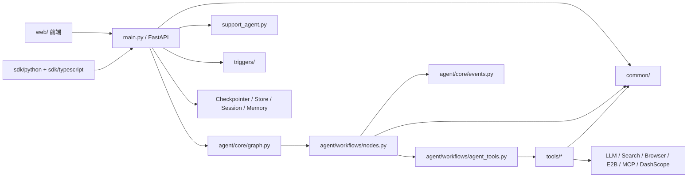

# Weaver 项目架构分析

基于当前仓库实现的静态分析，时间点为 2026-03-30。

## 分析范围

- 已重点阅读的运行时模块：`main.py`、`agent/`、`common/`、`tools/`、`triggers/`、`web/`、`sdk/`、`support_agent.py`
- 已读取的代表性配置：`README.md`、`pyproject.toml`、`web/package.json`、`sdk/typescript/package.json`
- 未逐文件展开的范围：`docs/` 中的说明文档、`eval/` 基准、`examples/` 示例、全部测试细节
- 结论分两类：
  - `事实`：可直接从代码或配置证明
  - `推断`：基于实际依赖和组合方式得出的架构判断

## 1. 架构概览

- `事实`：这是一个单仓库项目，核心由 Python 后端、Next.js 前端、Python/TypeScript SDK 组成。`README.md:8-16`、`web/package.json:5-58`、`sdk/typescript/src/client.ts:1-25`、`sdk/python/weaver_sdk/client.py:1-15`
- `事实`：后端运行入口集中在 `main.py`，它在进程启动时创建 `research_graph` 和 `support_graph`，并初始化 MCP、增强工具系统、ASR/TTS、默认 Agent 配置、触发器等运行时能力。`main.py:466-555`
- `事实`：主业务编排使用 LangGraph，`agent/core/graph.py` 定义了 `router -> direct/agent/web/deep/clarify` 等节点和多轮评估/修订路径。`agent/core/graph.py:35-220`
- `事实`：前端并不承担业务编排，它主要负责会话 UI、流式协议消费、工具活动展示和浏览器实时画面展示。`web/components/chat/Chat.tsx:24-188`、`web/hooks/useChatStream.ts:11-260`、`web/components/chat/BrowserViewer.tsx:34-220`
- `推断`：该项目更接近“前后端分离 + 工作流编排内核 + 模块化单体”的平台型架构，而不是严格的微服务或严格分层架构。置信度高。
- `推断`：`main.py` 更像一个平台 Shell/BFF，负责装配所有子系统；真正的业务能力分散在 `agent/`、`tools/`、`common/`、`triggers/`。但它自身仍然过大，属于明显的“组合点过度集中”。

## 2. 模块地图

| 模块 | 主要职责 | 关键证据 |
| --- | --- | --- |
| `main.py` | FastAPI 入口、生命周期管理、图执行装配、流式输出、会话/导出/触发器/浏览器/语音等 API | `main.py:466-555`、`main.py:2272-2465`、`main.py:5079-5175` |
| `agent/core/` | LangGraph 图定义、状态模型、智能路由、事件系统 | `agent/core/graph.py:35-220`、`agent/core/smart_router.py:22-197`、`agent/core/events.py:45-215` |
| `agent/workflows/` | 各节点具体实现、Deep Research、评估与修订、工具 Agent 工厂 | `agent/workflows/nodes.py:725-2453`、`agent/workflows/agent_factory.py:1-183`、`agent/workflows/agent_tools.py:82-260` |
| `tools/` | 搜索、浏览器、爬取、沙箱、自动化、RAG、导出、IO 等能力实现 | `agent/workflows/agent_tools.py:82-260`、`tools/search/multi_search.py:1-220`、`tools/research/content_fetcher.py:1-260` |
| `common/` | 配置、日志、SSE、指标、取消控制、会话与线程归属等横切基础设施 | `common/config.py`、`common/sse.py:1-118` |
| `triggers/` | 定时/Webhook/Event 触发器管理与持久化 | `triggers/manager.py:1-260`、`main.py:6307-6523` |
| `web/` | Next.js 前端壳、聊天界面、流式事件消费、浏览器实时视图 | `web/app/page.tsx:1-7`、`web/components/chat/Chat.tsx:24-188`、`web/hooks/useChatStream.ts:44-260` |
| `sdk/python` / `sdk/typescript` | 面向 API/SSE 的客户端封装，TypeScript 侧额外依赖 OpenAPI 生成类型 | `sdk/python/weaver_sdk/client.py:37-260`、`sdk/typescript/src/client.ts:44-242` |
| `support_agent.py` | 独立于主研究图之外的轻量客服图，带记忆召回/写回 | `support_agent.py:22-94` |
| `tests/` | 覆盖聊天流、浏览器 WS、搜索、会话、SDK、导出、触发器等关键面 | `tests/` 目录结构 |

## 3. 依赖方向

### 3.1 主要依赖规则

- `事实`：前端和 SDK 都只通过 HTTP/SSE/WS 契约依赖后端，没有直接导入 Python 运行时模块。`web/hooks/useChatStream.ts:44-69`、`web/hooks/useBrowserStream.ts:82-117`、`sdk/python/weaver_sdk/client.py:56-260`、`sdk/typescript/src/client.ts:61-242`
- `事实`：`main.py` 是总装配入口，向下依赖 `agent`、`common`、`tools`、`triggers`。`main.py:31-99`
- `事实`：LangGraph 图本身只定义节点和边，真正的节点实现集中在 `agent/workflows/nodes.py`。`agent/core/graph.py:8-28`、`agent/core/graph.py:56-217`
- `事实`：工具集合不是固定写死的，而是由 Agent 配置动态拼装，支持 web search、crawl、browser、sandbox、task list、computer use、MCP 等。`agent/workflows/agent_tools.py:82-260`
- `事实`：事件系统是独立横切层，工具和研究节点通过 `EventEmitter` 发事件，流式接口再把这些事件转给前端或 SSE 客户端。`agent/core/events.py:45-215`、`main.py:1786-1794`

### 3.2 重要例外和边界破坏

- `事实`：`tools/search/multi_search.py` 直接依赖 `agent.core.search_cache`。`tools/search/multi_search.py:29-31`
- `事实`：`tools/research/content_fetcher.py` 直接依赖 `agent.workflows.source_registry`。`tools/research/content_fetcher.py:13-17`
- `推断`：`tools/` 并不是完全独立的底层能力层，它已经回指 `agent` 内部模块，说明当前分层更接近“模块化单体中的实用耦合”，而不是严格的 clean architecture。
- `事实`：`pyproject.toml` 明确对 `main.py` 放宽复杂度限制，仓库已经承认它是“主单体文件，正在逐步重构”。`pyproject.toml:39-42`

## 4. 核心执行流程

### 4.1 聊天流式主链路

1. 前端根页面直接渲染 `Chat` 组件，`Chat` 维护消息、会话、附件、浏览器查看器等 UI 状态。`web/app/page.tsx:1-7`、`web/components/chat/Chat.tsx:24-72`
2. 用户提交消息后，`useChatStream` 调用 `POST /api/chat`，携带消息、模型、`search_mode` 和图片附件。`web/hooks/useChatStream.ts:44-69`
3. 后端 `chat()` 为流式请求创建 `thread_id`，然后把 `stream_agent_events()` 作为 `StreamingResponse` 返回。`main.py:2372-2428`
4. `stream_agent_events()` 创建取消令牌、事件发射器、初始状态、记忆注入和 LangGraph 配置，再以 `research_graph.astream_events()` 驱动整个执行过程。`main.py:1725-1865`
5. `create_research_graph()` 根据 `route` 将请求分到 `direct_answer`、`agent`、`web_plan`、`deepsearch` 或 `clarify`，并在深度研究路径上经过 `planner -> perform_parallel_search -> compressor -> writer -> evaluator/reviser/human_review`。`agent/core/graph.py:57-220`
6. 若进入 `agent` 模式，`build_agent_tools()` 会按 Agent Profile 拼出可用工具集合；若进入 `web/deep` 模式，则继续研究与聚合链路。`agent/workflows/agent_tools.py:82-260`
7. 运行过程中的 tool/status/search/research_node/quality/sources/completion 等事件被编码成流，前端按 legacy `0:{json}` 协议解析并更新消息、工具面板、状态条和 artifacts。`main.py:1866-2219`、`web/lib/chatStreamProtocol.ts:1-37`、`web/hooks/useChatStream.ts:156-260`

### 对这条链路的判断

- `推断`：这是全仓库最核心的“业务主干”，其余模块大多围绕它提供能力面。
- `推断`：路由与工具能力分离做得不错，但 API 装配、事件转换、记忆注入、日志和取消逻辑都压在 `main.py`，维护成本会持续上升。

### 4.2 SSE 兼容链路

1. SDK 客户端默认走 `/api/chat/sse`，而不是前端正在使用的 `/api/chat` 旧协议流。`sdk/python/weaver_sdk/client.py:93-162`、`sdk/typescript/src/client.ts:96-130`
2. `/api/chat/sse` 的实现并不重新跑另一套业务逻辑，而是包装 `stream_agent_events()`，把 legacy `0:{json}` 转换成标准 SSE 帧。`main.py:2272-2369`
3. TypeScript SDK 直接依赖 `openapi-types.ts` 中的生成类型，说明后端契约对 SDK 是一级边界。`sdk/typescript/src/client.ts:1-25`

### 对这条链路的判断

- `事实`：当前仓库同时维护“legacy 数据流协议”和“标准 SSE 协议”两套消费方式。`web/lib/chatStreamProtocol.ts:1-37`、`main.py:2272-2352`
- `推断`：这是典型的兼容层设计，短期能兼容前端和 SDK，长期则会增加协议演进成本。

### 4.3 浏览器实时视图链路

1. `BrowserViewer` 同时支持基于事件截图和基于 WebSocket 的实时画面流。`web/components/chat/BrowserViewer.tsx:21-88`
2. `useBrowserStream` 连接 `/api/browser/{thread_id}/stream`，发送 `start/stop/capture` 等控制消息，接收 `frame/status/error`。`web/hooks/useBrowserStream.ts:82-171`
3. 后端 `browser_stream_websocket()` 在建立连接前会校验内部鉴权、线程归属和持久化会话归属，然后推送 JPEG base64 帧。`main.py:5079-5175`

### 对这条链路的判断

- `推断`：浏览器流并不是“附属截图功能”，而是平台级能力，已经拥有独立协议、鉴权和连接生命周期管理。

### 4.4 触发器链路

1. `TriggerManager` 统一管理定时、Webhook、事件触发器，并将状态落到 `data/triggers.json`。`triggers/manager.py:32-45`、`triggers/manager.py:48-152`
2. `main.py` 暴露了一整组 `/api/triggers/*` 路由，说明触发器与主 API 同进程运行，而非外部调度服务。`main.py:6307-6523`

### 对这条链路的判断

- `推断`：Weaver 不只是“聊天 Agent 应用”，已经具备一定自动化平台属性。

## 5. 架构特征总结

### 5.1 优点

- 工作流编排清晰：LangGraph 图把路由、规划、检索、写作、评估、人工审批显式化。`agent/core/graph.py:35-220`
- 工具系统扩展性较好：Agent 工具按 Profile 和运行环境动态组装，而不是固定写死。`agent/workflows/agent_tools.py:82-260`
- 前端边界相对干净：前端主要关心流式协议和展示，不直接承担业务策略。`web/hooks/useChatStream.ts:44-260`
- SDK 边界明确：Python/TS SDK 都围绕 HTTP/SSE 契约构建，TS 端还直接绑 OpenAPI 类型。`sdk/python/weaver_sdk/client.py:56-260`、`sdk/typescript/src/client.ts:61-242`

### 5.2 风险和演进压力

- `main.py` 过大：启动、鉴权、路由、流式适配、导出、浏览器、触发器、语音、会话接口全部汇聚在一个文件。`main.py` 路由分布见 `main.py:1198-6523`
- `agent/workflows/nodes.py` 过于集中：它同时承载路由决策、规划、搜索、写作、评估、取消处理和多种 prompt heuristics。`agent/workflows/nodes.py:725-2453`
- `tools -> agent` 反向依赖已经出现，后续若继续扩张，会让工具层越来越难复用与测试。`tools/search/multi_search.py:29-31`、`tools/research/content_fetcher.py:13-17`
- 流式协议存在双轨制：前端和 SDK 使用的接口形态不同，容易造成行为漂移。`web/hooks/useChatStream.ts:49-69`、`main.py:2272-2369`

## 6. 架构结论

- `事实`：当前项目的主导执行模型不是传统 MVC，也不是纯 REST CRUD，而是“API 网关 + LangGraph 编排图 + 动态工具层”。
- `推断`：更准确的描述是“AI Agent 平台型模块化单体”，其主价值在于研究工作流、工具生态和多协议流式体验，而不是单个聊天页面。
- `推断`：若后续继续扩展，最值得优先拆分的并不是 `tools/`，而是 `main.py` 的 API Shell 和 `agent/workflows/nodes.py` 的节点实现聚合度。

## 7. 关键证据索引

- 仓库定位与技术栈：`README.md:8-34`
- Python 工程与复杂度说明：`pyproject.toml:1-45`
- 前端依赖与运行脚本：`web/package.json:5-58`
- 后端启动装配：`main.py:466-555`
- 聊天 legacy 流式入口：`main.py:2372-2428`
- 标准 SSE 兼容入口：`main.py:2272-2369`
- 浏览器实时 WS 入口：`main.py:5079-5175`
- LangGraph 图定义：`agent/core/graph.py:35-220`
- 智能路由模型：`agent/core/smart_router.py:22-197`
- 事件系统：`agent/core/events.py:45-215`
- 动态工具装配：`agent/workflows/agent_tools.py:82-260`
- 搜索聚合器：`tools/search/multi_search.py:1-220`
- 内容抓取器：`tools/research/content_fetcher.py:1-260`
- 触发器管理器：`triggers/manager.py:1-260`
- 前端聊天壳：`web/components/chat/Chat.tsx:24-188`
- 前端流式消费：`web/hooks/useChatStream.ts:44-260`
- 浏览器实时视图：`web/components/chat/BrowserViewer.tsx:21-220`
- 前端 WS 浏览器流：`web/hooks/useBrowserStream.ts:31-260`
- Python SDK：`sdk/python/weaver_sdk/client.py:37-260`
- TypeScript SDK：`sdk/typescript/src/client.ts:44-242`
