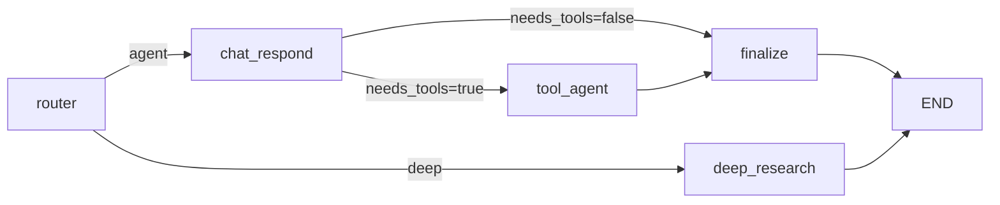

# 删除外层 Clarify 与旧 Research/Planner 流设计

## 1. 背景

当前仓库同时存在两套研究编排：

- 外层根图中的旧研究链路：
  `router -> clarify -> planner -> hitl_plan_review -> perform_parallel_search -> compressor -> hitl_sources_review -> writer -> hitl_draft_review -> evaluator -> revise/refine -> 根图最终收口`
- 内层 Deep Research 正式链路：
  `deep_research -> multi_agent runtime`

这两套链路已经职责重叠，而且边界不清：

- 外层 `clarify` 与内层 Deep Research `clarify` 语义重叠。
- 外层 planner/research/evaluator/reviser 链路已经不是复杂研究的主路径。
- 顶层公共状态仍携带大量只服务旧链路的字段，污染了运行时契约。
- `main.py` 中仍保留外层旧节点的 thinking/status 映射、恢复兼容和会话摘要字段。

本设计要求做一次有意的硬切：彻底删除外层 `clarify` 和整条旧 research/planner 流，不保留兼容层，不兼容旧 checkpoint/旧 session 数据。

## 2. 目标

### 2.1 目标

- 让外层根图只保留真正仍在使用的主路径。
- 彻底删除外层 `clarify` 及旧 planner/research/evaluator/reviser 链路。
- 让“澄清、scope、研究分派、审核、报告”只在 Deep Research 内层图存在。
- 删除顶层公共状态和公共契约中只服务旧链路的字段。
- 删除 `main.py` 中围绕旧链路的流式文案映射、恢复兼容和摘要字段。
- 允许破坏性 API/状态变化，不保留 deprecated path。

### 2.2 非目标

- 不迁移旧 checkpoint、旧 session、旧 resume 数据。
- 不保留旧外层 `clarify` 的 resume 能力。
- 不重构 Deep Research 内层 runtime 结构。
- 不重构 support graph。
- 不借此重写多模型配置系统。

## 3. 设计原则

- KISS：根图只保留当前真实使用的控制流。
- YAGNI：不为已决定废弃的链路保留状态、字段、提示词或测试。
- DRY：研究编排只保留一套正式实现，即 Deep Research 内层图。
- 单一职责：
  - 外层根图负责路由、执行、最终收口。
  - Deep Research 内层图负责复杂研究编排。
  - `main.py` 只对仍存在的运行节点做流式投影。

## 4. 当前问题归纳

### 4.1 根图职责膨胀

`agent/runtime/graph.py` 既承载普通 agent 路径，又承载一整条旧 research/planner 流，还桥接 deep runtime。根图已经不是“入口编排”，而是历史路径叠加后的混合图。

### 4.2 公共状态被旧链路污染

顶层 `AgentState`、`agent.domain.state`、`agent.application.state` 仍包含以下仅服务旧外层链路的字段：

- `needs_clarification`
- `clarification_question`
- `research_plan`
- `suggested_queries`
- `current_step`
- `evaluation`
- `verdict`
- `eval_dimensions`
- `missing_topics`
- `revision_count`
- `max_revisions`
- `compressed_knowledge`

这些字段使顶层状态形状比真实生产路径更大，也让 session/resume 读模型继续泄漏历史实现。

### 4.3 对外兼容层仍在传播旧抽象

`main.py` 里仍保留：

- 旧节点名的 thinking/status 映射
- 旧 planner/clarify 节点的中间输出过滤规则
- 顶层 `research_plan_count` 等恢复摘要字段
- 面向旧外层链路的契约影子

这些代码继续放大了“旧链路仍被支持”的错觉。

## 5. 目标架构

### 5.1 根图收缩

根图收缩为：

说明：

- `route_node` 只允许返回 `agent` 或 `deep`。
- 低置信度不再进入外层 `clarify`，统一回退到 `agent`。
- 复杂研究仍然走 `deep_research -> multi_agent runtime`。

### 5.2 Deep Research 成为唯一正式研究编排

以下能力只允许存在于 Deep Research 内层图：

- clarify
- scope / scope_review
- 计划拆解与 dispatch
- researcher / revisor / reviewer / verifier / reporter
- 章节审核、最终 claim gate、研究拓扑产物

外层不再保留任何并行搜索、写作优化、评估修订节点。

## 6. 代码删除与保留边界

### 6.1 根图与节点层

#### 删除

- `agent/runtime/graph.py` 中的以下节点及相关条件边：
  - `clarify`
  - `planner`
  - `refine_plan`
  - `hitl_plan_review`
  - `perform_parallel_search`
  - `writer`
  - `hitl_draft_review`
  - `evaluator`
  - `reviser`
  - `compressor`
  - `hitl_sources_review`
- 删除仅服务这些节点的局部路由函数：
  - `after_clarify`
  - `after_search`
  - `after_writer`
  - `after_evaluator`

#### 保留

- `router`
- `chat_respond`
- `tool_agent`
- `finalize`
- `deep_research`

### 6.2 运行时节点文件

#### 删除整个文件

- `agent/runtime/nodes/planning.py`
- `agent/runtime/nodes/review.py`

#### 删除文件内旧节点实现

- `agent/runtime/nodes/routing.py`
  - 删除外层 `clarify_node`
  - `route_node` 只产出 `agent|deep`
- `agent/runtime/nodes/chat.py`
  - 保留 `chat_respond_node`
- `agent/runtime/nodes/answer.py`
  - 删除 `writer_node`
  - 保留 `tool_agent_node`
- `agent/runtime/nodes/finalize.py`
  - 保留 `finalize_answer_node`

#### 更新导出

- `agent/runtime/nodes/__init__.py`
- `agent/runtime/__init__.py`

以上导出表必须同步收缩，避免残留死符号。

### 6.3 公共路由与执行模式

#### 删除

- `agent/core/smart_router.py`
  - 删除 `clarify` route type
  - 删除 `clarification_question` 字段
  - 删除 prompt 中对 `clarify` 的说明
- `agent/domain/execution.py`
  - 删除 `ExecutionMode.CLARIFY`
  - 删除公共 mode 到 `clarify` 的映射

#### 保留

- 公共聊天模式仍只支持 `agent` 和 `deep`
- `main.py` 现有对外 `SearchMode` 约束继续保持，只是内部也同步硬切

### 6.4 顶层公共状态

#### 从顶层状态中删除

- `needs_clarification`
- `clarification_question`
- `research_plan`
- `suggested_queries`
- `current_step`
- `evaluation`
- `verdict`
- `eval_dimensions`
- `missing_topics`
- `revision_count`
- `max_revisions`
- `compressed_knowledge`

涉及文件：

- `agent/core/state.py`
- `agent/domain/state.py`
- `agent/application/state.py`

#### 保留

- `scraped_content`
- `code_results`
- `summary_notes`
- `sources`
- `research_topology`
- `domain`
- `domain_config`
- `sub_agent_contexts`
- `deep_runtime`

理由：这些字段仍会被普通 agent 或 deep runtime 的结果投影使用。

### 6.5 main.py 兼容层与流式映射

#### 删除

- 旧 `clarify/planner/refine_plan/perform_parallel_search/compressor/evaluator/reviser` 的 thinking/status 文案映射
- 仅服务旧外层节点的中间输出过滤与 node allowlist 逻辑
- 旧外层恢复摘要字段，如 `research_plan_count`
- chat graph config 中仅服务旧 revision loop 的 `max_revisions`
- 初始 state 构造里传递给旧链路的 `max_revisions`

#### 保留

- `deep_research_clarify` 的 resume payload normalize

理由：它属于 Deep Research 内层正式流程，不属于本次删除对象。

## 7. 对外契约变化

### 7.1 允许的破坏性变化

- 顶层状态切片不再包含旧 research/planner/clarify 字段。
- 历史 checkpoint / 历史 session 恢复不再兼容。
- 顶层 resume/session 摘要不再返回 `research_plan_count` 等旧字段。
- 内部 router 不再返回 `clarify`。

### 7.2 不变项

- 对外聊天模式仍然是 `agent|deep`。
- Deep Research 仍保留内层 clarify/scope/review/report 机制。
- support graph 行为不变。

## 8. 测试策略

### 8.1 删除旧测试

以下测试应删除或重写，因为它们只验证已废弃节点：

- `tests/test_hitl_checkpoint_review_nodes.py`
- `tests/test_evaluator_emits_quality_update.py`
- `tests/test_evaluator_persists_quality_summary.py`
- `tests/test_export_json_quality_from_evaluator.py`
- `tests/test_report_citation_gate.py`
- `tests/test_claim_verifier_gate.py`
- `tests/quick_test.py` 中对 `writer_node` 的检查

### 8.2 重写状态与恢复测试

以下测试需要同步收缩断言：

- `tests/test_agent_state_slices.py`
- `tests/test_resume_session_deepsearch.py`
- `tests/test_session_deepsearch_artifacts.py`
- `tests/test_thread_authz_interrupt_and_resume.py`

### 8.3 新增回归点

至少增加以下回归测试：

- 根图编译后不再包含外层旧节点
- router 只产出 `agent|deep`
- 低置信度路由回退到 `agent`
- deep runtime 的 `deep_research_clarify` interrupt/resume 仍可工作

## 9. 实施顺序

1. 先收缩根图与路由契约，切断旧链路可达性。
2. 再删除节点实现和导出表，清掉死代码。
3. 再收缩顶层状态、domain 映射、应用初始 state。
4. 最后清理 `main.py` 的流式映射、resume 摘要和测试。
5. 使用受影响测试子集验证普通 agent 与 deep runtime 两条主路径仍正常。

## 10. 风险与处理

### 10.1 风险

- 某些测试或调试脚本仍隐式依赖旧字段。
- `main.py` 中基于 node name 的流式投影逻辑可能残留旧分支。
- 顶层状态切片收缩后，session 读取代码可能还有旧字段假设。

### 10.2 处理

- 以“先切根图，再删实现，再删状态，再清测试”的顺序推进，减少定位成本。
- 所有旧字段按全局搜索结果成组删除，不做局部保留。
- 旧数据兼容明确放弃，由人工清库解决。

## 11. 验收标准

- 根图中不再存在外层 `clarify` 与旧 research/planner 链路节点。
- 顶层公共状态与切片中不再存在旧链路字段。
- `smart_router` 与 `ExecutionMode` 不再包含外层 `clarify`。
- `main.py` 不再为外层旧节点输出 thinking/status 或恢复摘要。
- deep runtime 相关主测试仍通过。
- 普通 agent 路径与 deep 路径都能正常完成一次请求。
