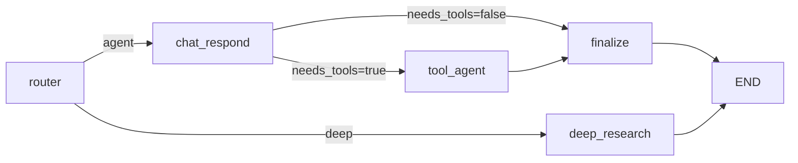
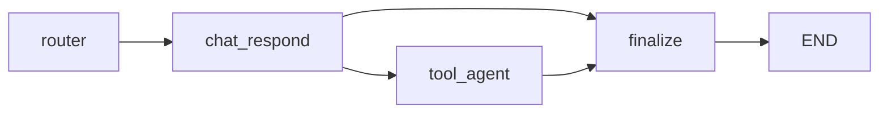

# Agent Chat-First Runtime 重设计

## 1. 背景

当前仓库的顶层聊天根图已经收缩为：

但 `agent` 节点内部仍然是“tool-first”设计：

- 默认进入 `agent_node` 后就装配工具并创建 LangChain tool-calling agent。
- 普通对话只是“工具代理没有实际调用工具”时的退化结果。
- `messages` 同时承载真实对话、profile prompt、memory 注入、浏览器提示等多类语义。
- `answer.py` 同时承担 fast path、prompt 拼装、工具装配、代理执行、卡死补救、状态投影等职责。

这套实现更接近通用工具代理，而不是用户期望的“像 ChatGPT 一样先正常聊天，必要时才升级工具”。

本设计的目标是把 `agent` 分支重构为 **chat-first** 运行模型：

- 默认先走普通对话
- 仅当回答必须依赖外部能力时才升级到工具路径
- 保留现有 LangChain/LangGraph agent 基建，但把它从默认主路径降为受控升级路径

## 2. 目标

### 2.1 目标

- 将 `agent` 分支从“默认工具代理”改为“默认普通对话”。
- 把“是否使用工具”变成显式控制点，而不是隐藏在胖节点内部。
- 让 `messages` 只保存真实会话消息。
- 将 profile、memory、browser hint 从持久消息流中剥离，改为运行时注入。
- 保留现有工具基础设施与 LangChain `create_agent` 能力，避免重写底层 ReAct loop。
- 为后续可观测性、工具权限收缩、行为调优提供清晰边界。
- 保持 `deep_research` 分支语义封闭，不再因简单事实型问题回退到 `agent_node`。
- 删除旧的 `agent_node` 兼容入口，对外只保留 chat-first 原生节点。

### 2.2 非目标

- 不重写顶层 `router` 与 `deep_research` 逻辑。
- 不重构 Deep Research 内层 runtime。
- 不改造 support graph。
- 不在本次设计中引入多 agent 协作。
- 不重写现有全部 API 契约；兼容字段允许暂时保留。
- 不把 deep 模式与 agent 模式重新耦合为“可相互降级”的双向执行关系。

## 3. 设计原则

- KISS：默认路径就是普通聊天，不让每轮都先进入工具代理。
- YAGNI：不引入额外 `prepare_context` 节点，除非后续确认上下文整理已成为独立复杂步骤。
- DRY：收口 prompt 拼装、状态投影、输出 contract，避免聊天路径和工具路径各写一套。
- 单一职责：
  - `chat_respond` 负责普通对话和是否升级工具的初判
  - `tool_agent` 负责最小授权工具执行
  - `finalize` 负责统一收口

## 4. 当前问题

### 4.1 默认路径错误

当前 `agent` 节点除了 fast path 之外，默认会：

1. 取模型
2. 装配工具集
3. 创建 tool-calling agent
4. 调用 `agent.invoke(...)`

这使普通聊天不再是一等路径，而只是代理路径的副产品。

### 4.2 `messages` 被混用

当前 `messages` 同时包含：

- 用户/助手历史对话
- profile system prompt
- stored memories
- relevant memories
- browser hint

这些内容语义不同，混用会导致：

- 历史上下文不稳定
- 主 prompt 注入逻辑失真
- 后续多轮对话行为漂移

### 4.3 Prompt 注入存在硬冲突

当前实现存在“只要已有任意 `SystemMessage`，就不再注入运行时增强 prompt”的逻辑。  
一旦 profile 或 memory 先进入 `messages`，运行时主 prompt 就可能失效。

### 4.4 工具授权过宽

当前路径偏向一次性把 profile 对应的工具集整体暴露给 agent。  
这与“只有确实需要外部能力时才升级”的产品目标相冲突，也放大了误触发与行为复杂度。

## 5. 目标架构

外层根图改为：

### 5.1 设计含义

- `chat_respond` 是 `agent` 模式的默认执行入口。
- 工具调用不再是默认主路径，而是条件升级路径。
- `tool_agent` 只在必须借助外部能力时执行。
- `finalize` 统一负责当前回合结果落盘与兼容字段投影。
- `deep_research` 继续作为独立模式存在；即使问题简单，也由 deep runner 自己决定如何完成，不再回退到 `agent` 分支。
- 旧的单入口 `agent_node` 不再作为公共运行时符号保留。

## 6. 节点职责

### 6.1 `chat_respond`

职责：

- 使用普通聊天模型优先生成回答。
- 基于用户问题和当前上下文，判断是否必须升级到工具路径。
- 产出结构化结果，供后续条件边使用。

输入：

- 真实多轮 `messages`
- 当前用户输入 `input`
- 运行时 system prompt
- 本轮按需检索的 memory 上下文

输出：

- `assistant_draft`
- `needs_tools`
- `tool_reason`
- `required_capabilities`

约束：

- 默认不挂全量工具。
- 允许使用轻量结构化输出，但不允许在这里直接接管工具执行。

### 6.2 `tool_agent`

职责：

- 在需要外部能力时执行一次受控升级。
- 使用最小授权工具集获取缺失信息或完成外部操作。
- 返回补全后的回答与工具观察结果。

输入：

- 当前用户请求
- `assistant_draft`
- `tool_reason`
- `required_capabilities`

输出：

- `tool_observations`
- `assistant_draft` 或最终回答
- 真实 `ToolMessage`
- 必要时写入 `scraped_content`

约束：

- 不再默认拿全量工具集。
- 工具集必须按 `required_capabilities` 最小化装配。

### 6.3 `finalize`

职责：

- 统一应用输出 contract。
- 统一将 assistant 最终回复写回 `messages`。
- 将当前回合结果投影到兼容字段。

输入：

- `assistant_draft`
- `tool_observations`
- `messages`

输出：

- `final_report`
- `draft_report`
- 当前回合 assistant `AIMessage`
- 兼容性状态投影

约束：

- `is_complete` 由 `finalize` 或 `deep_research` 自身产出终态，根图直接 `END`。
- 不在聊天路径和工具路径分别复制收尾逻辑。

## 7. `needs_tools` 判定机制

采用 **硬规则优先 + 模型补充判断** 的混合策略。

### 7.1 硬规则强制升级

以下场景直接判定 `needs_tools=true`：

- 明确要求最新、今天、现在、实时信息
- 明确要求网页搜索、打开网站、点击、抓取页面
- 明确要求文件读写
- 明确要求代码执行、计算、图表生成

### 7.2 模型补充判断

规则未命中时，由 `chat_respond` 结构化输出判断：

- 是否只靠已有上下文即可高质量回答
- 若不能，缺的是哪类外部能力

限制能力枚举为：

- `web_search`
- `browser`
- `files`
- `python`

### 7.3 非升级场景

以下情况默认不升级：

- 闲聊
- 常识问答
- 解释概念
- 翻译、改写、总结用户已提供文本
- 不依赖实时信息的一般建议

## 8. 状态契约

### 8.1 `messages` 的新语义

`messages` 只保存真实会话消息：

- `HumanMessage`
- `AIMessage`
- `ToolMessage`（仅在实际走工具路径时）

以下内容不再持久写入 `messages`：

- profile prompt
- memory 注入文本
- browser hint
- 本轮临时说明

### 8.2 `input` 的语义

- `input` 保留为当前用户最新一轮文本的快捷字段
- `messages` 才是会话真源
- 不允许长期出现 `input` 与最后一条用户消息不一致的状态

### 8.3 保留字段

- `messages`
- `input`
- `draft_report`
- `final_report`
- `scraped_content`
- `errors`
- `tool_call_count`
- `pending_tool_calls`
- `enabled_tools`

### 8.4 新增字段

- `assistant_draft: str`
- `needs_tools: bool`
- `tool_reason: str`
- `required_capabilities: list[str]`
- `tool_observations: list[dict[str, Any]]`

### 8.5 兼容字段策略

- `draft_report`、`final_report` 暂时保留
- 但其语义收缩为“当前 assistant 回复的兼容投影”
- `messages` 才是多轮对话真源

## 9. Profile、Memory、Browser Hint 的处理方式

### 9.1 Profile

- 不再持久写成 `SystemMessage`
- 每轮通过统一 prompt builder 动态生成 system prompt
- 用于融合：
  - assistant 基础行为
  - profile 指令
  - 当前模式约束

### 9.2 Memory

- 不再写入 `messages`
- 保持结构化数据或从 store 动态检索
- 在 `chat_respond` 中按需转成少量上下文块注入 prompt

### 9.3 Browser Hint

- 默认普通聊天路径不注入
- 只在进入 `tool_agent` 且需要浏览器能力时临时注入
- 不持久写回消息历史

## 10. 工具装配策略

保留现有基础设施：

- `agent/infrastructure/tools/assembly.py`
- `agent/infrastructure/agents/factory.py`

但修改入口语义：

- 从“按 profile 全量装配”改为“按本轮能力需求最小装配”

新增能力装配接口，例如：

- `build_tools_for_capabilities(required_capabilities, config)`

能力到工具映射示意：

- `web_search` -> 搜索相关工具
- `browser` -> 浏览器相关工具
- `files` -> 文件相关工具
- `python` -> 代码执行相关工具

## 11. 对现有实现的调整边界

### 11.1 删除或降级

- 删除“已有 `SystemMessage` 就不注入主 prompt”的逻辑
- 删除 memory 伪装成历史消息的做法
- 删除 browser hint 默认进入普通聊天路径的行为
- 将 fast path 从黑盒暗分支降级为 `needs_tools` 体系的一部分

### 11.2 保留

- 顶层 `router`
- 根图直接 `END` 收口
- 现有 checkpointer / store / session 流程
- 现有工具基础设施与 `create_agent` 执行能力

## 12. 迁移步骤

### 12.1 第一步：拆分 `answer.py`

将当前胖节点拆为：

- `chat_respond_node`
- `tool_agent_node`
- `finalize_answer_node`

先拆职责，再改根图边，降低一次性改动风险。

### 12.2 第二步：统一 prompt builder

新增统一 prompt 构造入口，负责：

- system prompt
- profile 注入
- memory 注入
- browser hint 注入

不再依赖持久 `SystemMessage`。

### 12.3 第三步：引入 capability-based tool assembly

在不推翻现有工具注册与 provider 组合逻辑的前提下，引入按能力最小装配的调用入口。

### 12.4 第四步：修改根图

将当前：

替换为：

### 12.5 第五步：清理旧语义

- 调整 `messages` 初始化逻辑
- 清理 profile/memory/browser hint 的持久消息写入
- 统一 assistant 回合消息回写方式

## 13. 测试策略

至少补以下回归测试：

- 普通闲聊不进入工具路径
- 非实时知识问答不进入工具路径
- 最新信息问题进入搜索工具路径
- 文件操作问题进入文件工具路径
- 浏览器操作问题进入浏览器工具路径
- 多轮对话上下文连续
- memory 命中不污染 `messages`
- profile 在存在 memory 时仍稳定生效
- tool path 仅开放最小能力对应工具

## 14. 风险与取舍

### 14.1 风险

- 普通聊天与工具升级的判定初期可能存在误判
- 现有 API 或下游逻辑可能隐式依赖历史 `SystemMessage` 结构
- 根图节点变多后，流式状态文案与监控映射需要同步调整

### 14.2 取舍

- 选择显式节点拆分，而不是继续在单节点内部堆条件分支
- 选择继续复用 LangChain tool agent，而不是手写底层 ReAct loop
- 选择兼容保留 `draft_report/final_report`，避免一次性打穿全部对外契约

## 15. 一句话结论

将当前 `agent` 分支重构为：

**默认普通对话、按需升级到最小授权工具代理、统一由 `finalize` 收口的 chat-first 双阶段运行模型。**
