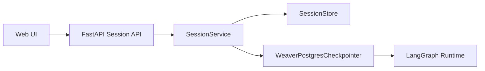

# 会话持久化与 Checkpoint 重写设计

## 1. 背景

当前项目的“会话持久化”职责混在三层里：

- `LangGraph checkpointer` 保存运行恢复状态。
- `common/session_manager.py` 扫 checkpoint 并拼装会话读模型。
- `web/hooks/useChatHistory.ts` 将消息、摘要、置顶等数据再次写入前端 `localStorage`。

这套实现存在几个结构性问题：

- checkpoint 被当作业务会话数据源使用，职责错误。
- 会话列表、会话详情、恢复状态分别从不同来源推断，语义不一致。
- 删除逻辑在“真删”和“标记删除”之间漂移。
- 前端本地缓存与后端 checkpoint 共同维护聊天历史，导致双轨持久化。
- 当前 checkpoint 包装层已经暴露缺陷，用户明确要求不要复用现有实现。

本设计做一次硬切重写：

- 保留 LangGraph 的 `thread_id / checkpoint / interrupt / resume / time travel` 语义。
- 不复用当前 checkpoint 存储实现和 `SessionManager` 的旧职责。
- 新增独立 `SessionStore` 托管会话元数据与消息快照。
- 新增自定义 `WeaverPostgresCheckpointer` 托管 LangGraph 恢复状态。
- 不兼容旧 `localStorage` 会话、旧 checkpoint 读模型和旧会话恢复路径。

## 2. 目标

### 2.1 目标

- 让业务会话与 LangGraph 恢复状态彻底分层。
- 让会话列表和聊天历史以后端服务端存储为唯一真相源。
- 重写 checkpoint 存储层，保留 LangGraph 原生恢复语义，但不复用当前实现。
- 为 interrupt/resume、取消、失败、删除定义一致且可测试的语义。
- 消除前端 `localStorage` 对会话真相源的主导地位。

### 2.2 非目标

- 不迁移旧 `localStorage` 会话。
- 不兼容旧 checkpoint 读模型。
- 不在本次重写中引入事件溯源式消息模型。
- 不在本次重写中持久化 deep research artifacts 明细到 `SessionStore`。
- 不保留 `MemorySaver()` 作为与生产等价的降级后端。

## 3. 设计原则

- KISS：将系统明确拆成“会话层”和“恢复层”两类持久化。
- YAGNI：不为旧模型、旧会话、旧兼容路径补迁移层。
- DRY：会话元数据和消息快照只在 `SessionStore` 保存一次。
- 单一职责：
  - `SessionStore` 负责业务会话。
  - `WeaverPostgresCheckpointer` 负责 LangGraph 恢复。
  - `SessionService` 负责应用编排。

## 4. 目标架构

### 4.1 分层

### 4.2 职责边界

#### SessionStore

负责：

- 会话元数据
- 聊天消息快照
- 会话列表、会话详情、会话删除
- 标题、摘要、置顶、标签等展示态字段

不负责：

- interrupt 原始数据
- checkpoint 历史
- deep runtime 内部状态
- browser / sandbox 运行态

#### WeaverPostgresCheckpointer

负责：

- checkpoint 保存
- pending writes 保存
- checkpoint 历史读取
- interrupt / resume 恢复读取
- thread 级恢复状态删除

不负责：

- 会话列表
- 聊天消息恢复视图
- 标题和摘要
- 用户界面元数据

#### SessionService

负责组合 `SessionStore` 和 `WeaverPostgresCheckpointer`：

- 建会话
- 写 user message
- 在流式终态时落盘 assistant message
- 标记运行状态
- 组装会话快照
- 删除会话并清理 checkpoint

## 5. 数据模型

### 5.1 会话层

新增 `sessions`：

- `thread_id` 主键
- `user_id`
- `title`
- `summary`
- `status`
- `route`
- `message_count`
- `is_pinned`
- `tags jsonb`
- `created_at`
- `updated_at`
- `last_message_at`

说明：

- `thread_id` 既是会话主键，也是 LangGraph thread 主键，不引入第二套 `session_id`。
- `title` 与 `summary` 允许服务端自动生成，也允许后续人工更新。

新增 `session_messages`：

- `id`
- `thread_id`
- `seq`
- `role`
- `content`
- `attachments jsonb`
- `sources jsonb`
- `tool_invocations jsonb`
- `process_events jsonb`
- `metrics jsonb`
- `created_at`
- `completed_at`

说明：

- `seq` 保证同一会话内消息顺序稳定。
- `jsonb` 仅用于 UI 相关的附属结构，不做复杂拆表。
- `SessionStore` 存的是展示态消息快照，不是底层事件流。

### 5.2 Checkpoint 层

新增 `graph_checkpoints`：

- `thread_id`
- `checkpoint_ns`
- `checkpoint_id`
- `parent_checkpoint_id`
- `created_at`
- `checkpoint_payload`
- `metadata_payload`

约束：

- 主键：`(thread_id, checkpoint_ns, checkpoint_id)`
- 索引：`(thread_id, checkpoint_ns, created_at desc)`
- 索引：`(thread_id, checkpoint_ns, parent_checkpoint_id)`

新增 `graph_checkpoint_writes`：

- `thread_id`
- `checkpoint_ns`
- `checkpoint_id`
- `task_id`
- `task_path`
- `write_idx`
- `channel`
- `value_payload`
- `created_at`

约束：

- 主键：`(thread_id, checkpoint_ns, checkpoint_id, task_id, write_idx)`
- 索引：`(thread_id, checkpoint_ns, checkpoint_id)`

说明：

- pending writes 与 checkpoint 主记录严格分表。
- payload 使用兼容 LangGraph serializer 的序列化结果，不手写一套 JSON 兼容规则。

## 6. Checkpointer 契约

`WeaverPostgresCheckpointer` 至少实现以下接口：

- `aget_tuple(config)`
- `alist(config, filter=None, before=None, limit=None)`
- `aput(config, checkpoint, metadata, new_versions)`
- `aput_writes(config, writes, task_id, task_path="")`
- `get_tuple(config)`
- `list(config, filter=None, before=None, limit=None)`
- `put(config, checkpoint, metadata, new_versions)`
- `put_writes(config, writes, task_id, task_path="")`
- `adelete_thread(thread_id)`
- `delete_thread(thread_id)`

语义约束：

- `put` 只写 checkpoint 主记录。
- `put_writes` 只写 pending writes。
- `get_tuple` 在给定 `checkpoint_id` 时精确读取，在未给定时读取最新 checkpoint。
- `list` 只做 checkpoint 历史读取，不推断会话摘要。
- `put_writes` 必须幂等，重复写同一 `(thread_id, checkpoint_ns, checkpoint_id, task_id, write_idx)` 不得产生重复记录。

事务边界：

- `put` 单独事务。
- `put_writes` 单独事务。
- `get_tuple` 只读拼装，不跨写事务。
- `list` 不 join writes。

删除语义：

- checkpoint 层只支持 thread 级硬删除。
- 不再通过修改 checkpoint state 模拟删除。

## 7. API 重构

### 7.1 保留并重定义

`GET /api/sessions`

- 只从 `SessionStore` 读取会话列表。
- 不再扫描 checkpoint 历史。

`GET /api/sessions/{thread_id}`

- 从 `SessionStore` 读取元数据。
- `can_resume` 或 pending interrupt 派生值按需查询 checkpoint。

`DELETE /api/sessions/{thread_id}`

- 先删 `SessionStore`
- 再删 checkpoint thread
- 若 checkpoint 清理失败但业务会话已删除，则接口仍返回成功，并显式带出后台清理待处理标记

### 7.2 新增

`GET /api/sessions/{thread_id}/snapshot`

返回：

- 会话元数据
- 有序消息列表
- `pending_interrupt`
- `can_resume`
- 当前页面恢复所需最小字段

`PATCH /api/sessions/{thread_id}`

允许更新：

- `title`
- `summary`
- `is_pinned`
- `tags`

### 7.3 语义收窄

`GET /api/sessions/{thread_id}/state`

- 保留为 runtime/debug 接口
- 继续服务 resume 相关后端逻辑
- 不再作为聊天记录恢复接口

## 8. 运行时写入链路

### 8.1 新建会话

- 首次用户提问即创建 `sessions` 记录。
- 先写 user message，再进入图执行。
- 初始状态从 `pending` 进入 `running`。

### 8.2 消息写入

立即落盘：

- user message
- 会话状态变更
- 标题、摘要、更新时间、message_count

边界事件落盘：

- assistant 最终内容
- assistant 的 `sources / tool_invocations / process_events / metrics`

原则：

- 不做 token 级数据库写入。
- 不在流式中持续覆盖 assistant 草稿。
- 在 `completion / interrupt / cancelled / error / done` 这类边界事件时一次性写 assistant message。

### 8.3 interrupt / resume

- `pending_interrupt` 不写入 `SessionStore`，继续由 checkpoint 派生。
- 发生 interrupt 时：
  - 落盘当前 assistant 可见内容
  - 更新会话状态为 `interrupted`
- resume 时：
  - 有新增用户输入则先写一条 user message
  - 新一轮 assistant 在终态时写入一条 assistant message

### 8.4 cancel / fail

- cancel：
  - checkpoint 负责真正中断图执行
  - `SessionStore` 更新会话状态为 `cancelled`
  - 如已有可见 assistant 内容，可以作为部分输出落盘

- fail：
  - `SessionStore` 更新会话状态为 `failed`
  - 允许落盘一条明确错误 assistant message

## 9. 标题与摘要规则

- 默认标题：首条 user message 前 40 字
- 默认摘要：最后一条 assistant message 前 140 字；若无 assistant，则取最后一条 user message
- 手工重命名后，自动摘要更新不得覆盖人工标题

## 10. 错误处理

- `SessionStore` 写失败：请求直接失败，不启动图执行。
- checkpoint 写失败：请求直接失败，并将会话标记为 `failed`。
- assistant 终态落盘失败：请求结束前标记会话为 `failed` 并记录诊断日志。
- 删除时 checkpoint 清理失败：业务会话删除成功，接口返回成功并带 `checkpoint_cleanup_pending=true`，checkpoint 残留交给后台清理，不回滚业务删除。

## 11. 环境与硬切规则

- 不兼容旧 `localStorage` 会话。
- 不兼容旧 checkpoint 读模型。
- 没有 Postgres 时，会话能力与 checkpoint 能力都视为不可用。
- 不再回退 `MemorySaver()` 作为同等恢复能力替身。
- 前端 `web/hooks/useChatHistory.ts` 不再把 `localStorage` 作为会话真相源。

## 12. 测试策略

后端至少覆盖：

- `WeaverPostgresCheckpointer`
  - `put/get_tuple/list/put_writes/delete_thread`
  - 指定 checkpoint 与最新 checkpoint 读取
  - pending writes 组装
  - 幂等写入
- `SessionStore`
  - 建会话
  - 追加消息
  - 列表排序
  - 元数据更新
  - 删除
  - 用户隔离
- `SessionService`
  - start session
  - finalize assistant
  - interrupt
  - resume
  - cancel
  - failed
  - 删除编排
- API
  - `GET /api/sessions`
  - `GET /api/sessions/{thread_id}`
  - `GET /api/sessions/{thread_id}/snapshot`
  - `PATCH /api/sessions/{thread_id}`
  - `DELETE /api/sessions/{thread_id}`
  - interrupt / resume 鉴权

前端至少覆盖：

- `useChatHistory` 改造后不再依赖 `localStorage` 真相源
- 打开历史会话
- 改名 / 置顶
- 删除
- interrupt 恢复

## 13. 风险与约束

- assistant 只在边界事件落盘，服务中途崩溃时本轮部分输出不会进入 `SessionStore`。
- 会话与 checkpoint 强依赖 Postgres，开发环境要求变高。
- 删除采用“业务先删、checkpoint 后删”，后台需要补充残留清理任务。

## 14. 验收标准

- 会话列表与聊天历史完全来自服务端 `SessionStore`。
- checkpoint 不再被当作会话列表或消息恢复数据源。
- interrupt/resume 仍按 LangGraph 原语工作。
- 删除语义一致且可测试。
- 前端不再依赖 `localStorage` 保存业务会话真相。
- 当前 `SessionManager` 的 checkpoint 包装式职责被删除或拆解为新的 `SessionStore + SessionService` 结构。
